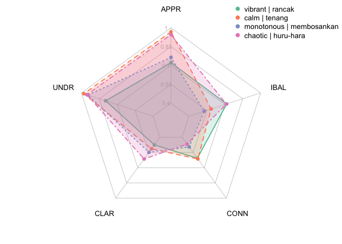

Replication code for “Crossing the Linguistic Causeway: A Binational
Approach for Translating Soundscape Attributes to Bahasa Melayu”
================

This repository contains the code accompanying the publication “Crossing
the Linguistic Causeway: A Binational Approach for Translating
Soundscape Attributes to Bahasa Melayu”. This paper is hosted on
[arXiv]() and the raw dataset is hosted at
[10.21979/N9/0NE37R](https://doi.org/10.21979/N9/0NE37R).

## Environment

The code has been tested on the following platform.

**R version 4.1.1 (2021-08-10)**

**Platform:** aarch64-apple-darwin20 (64-bit)

**locale:**
en_US.UTF-8\|\|en_US.UTF-8\|\|en_US.UTF-8\|\|C\|\|en_US.UTF-8\|\|en_US.UTF-8

**attached base packages:** *stats*, *graphics*, *grDevices*, *utils*,
*datasets*, *methods* and *base*

**other attached packages:** *RColorBrewer(v.1.1-3)*, *fmsb(v.0.7.1)*,
*conover.test(v.1.1.5)*, *muStat(v.1.7.0)*, *rstatix(v.0.7.0)*,
*tidyr(v.1.2.0)*, *kableExtra(v.1.3.4)*, *stringr(v.1.4.0)*,
*dplyr(v.1.0.9)*, *dataverse(v.0.3.10)* and *pander(v.0.6.5)*

**loaded via a namespace (and not attached):** *tidyselect(v.1.1.2)*,
*xfun(v.0.31)*, *purrr(v.0.3.4)*, *haven(v.2.4.3)*, *carData(v.3.0-4)*,
*colorspace(v.2.0-3)*, *vctrs(v.0.4.1)*, *generics(v.0.1.2)*,
*htmltools(v.0.5.2)*, *viridisLite(v.0.4.0)*, *yaml(v.2.3.5)*,
*utf8(v.1.2.2)*, *rlang(v.1.0.3)*, *pillar(v.1.7.0)*,
*foreign(v.0.8-81)*, *glue(v.1.6.2)*, *DBI(v.1.1.1)*, *readxl(v.1.3.1)*,
*lifecycle(v.1.0.1)*, *cellranger(v.1.1.0)*, *munsell(v.0.5.0)*,
*zip(v.2.2.0)*, *rvest(v.1.0.2)*, *evaluate(v.0.15)*,
*forcats(v.0.5.1)*, *knitr(v.1.39)*, *rio(v.0.5.27)*,
*fastmap(v.1.1.0)*, *curl(v.4.3.2)*, *fansi(v.1.0.3)*, *broom(v.0.7.9)*,
*Rcpp(v.1.0.8.3)*, *scales(v.1.2.0)*, *backports(v.1.4.1)*,
*webshot(v.0.5.3)*, *abind(v.1.4-5)*, *systemfonts(v.1.0.4)*,
*hms(v.1.1.0)*, *digest(v.0.6.29)*, *openxlsx(v.4.2.4)*,
*stringi(v.1.7.6)*, *cli(v.3.3.0)*, *tools(v.4.1.1)*,
*magrittr(v.2.0.3)*, *tibble(v.3.1.7)*, *crayon(v.1.5.1)*,
*car(v.3.0-11)*, *pkgconfig(v.2.0.3)*, *ellipsis(v.0.3.2)*,
*data.table(v.1.14.2)*, *xml2(v.1.3.3)*, *assertthat(v.0.2.1)*,
*rmarkdown(v.2.14)*, *svglite(v.2.1.0)*, *httr(v.1.4.3)*,
*rstudioapi(v.0.13)*, *R6(v.2.5.1)* and *compiler(v.4.1.1)*

## Data preparation

The raw data file is retrieved and cleaned.

### Dataloader

The raw dataset is retrieved from the DR-NTU (Data)
\[<https://researchdata.ntu.edu.sg>\] Dataverse repository at
[10.21979/N9/0NE37R](https://doi.org/10.21979/N9/0NE37R) and processed.

``` r
#Set dataverse server
Sys.setenv("DATAVERSE_SERVER" = "https://researchdata.ntu.edu.sg")
#Retrieve raw data in csv
dataset <- get_dataframe_by_name(
  filename = "SATPQn.csv", 
  dataset = "doi:10.21979/N9/0NE37R",
  original = TRUE,
  .f = read.csv)
```

### Data cleaning

The raw data headers are first converted to ASCII to remove UTF-8
formatting. The survey responses are subsetted to remove participant
data with “country of residence” that is neither Singapore (SG) or
Malaysia (MY). The resulting dataset consists of 63 participant
responses after the removal of 3 participants.

This is followed by extraction of individual dataframes corresponding to
the respective criteria categories for main and derived axis attributes,
respectively.

``` r
#convert column names to ASCII
colnames(dataset)<-iconv(colnames(dataset),
                        from = 'UTF-8', 
                        to = 'ASCII//TRANSLIT') 

#remove non-SG/MY respondents
sgmydata <- dataset %>%
        dplyr::rename(COUNTRY=Current.country.of.residence) %>%
        mutate(COUNTRY=ifelse(COUNTRY=="Malaysia","MY", COUNTRY)) %>%
        mutate(COUNTRY=ifelse(COUNTRY=="Singapore","SG", COUNTRY)) %>%
        mutate(COUNTRY=ifelse(COUNTRY=="Europe","Others", COUNTRY)) %>%
        mutate(COUNTRY=ifelse(COUNTRY=="Asia (excl. MY and SG)",
                              "Others", COUNTRY)) %>%
        filter(!str_detect(COUNTRY, "Others"))

#define column names for main and derived axes
mainColnames<-c('COUNTRY','APPR','UNDR','ANTO','BIAS',
                'ASSOCCW','IMPCCW','ASSOCW','IMPCW','CANDIDATE')

derivedColnames<-c('COUNTRY','APPR','UNDR','ASSOCCW',
                   'IMPCCW','ASSOCW','IMPCW','CANDIDATE')

#extract responses for each PAQ attribute and rename columns with criteria
#main axes
eventdf<-sgmydata %>% 
        select(matches('that.meriah|is.meriah|COUNTRY')) %>%
        mutate(candidate="meriah") %>% setNames(mainColnames)

pleasdf<-sgmydata %>%
        select(matches('menyenangkan|COUNTRY')) %>%
        mutate(candidate="menyenangkan") %>% setNames(mainColnames)

uneventdf<-sgmydata %>%
        select(matches('tidak.meriah|COUNTRY')) %>%
        mutate(candidate="tidak meriah") %>% setNames(mainColnames)

annoydf<-rbind(sgmydata %>%
                select(matches('membingitkan|COUNTRY')) %>%
                mutate(candidate="membingitkan") %>% 
                setNames(mainColnames),
               sgmydata %>%
                select(matches('menjengkelkan|COUNTRY')) %>%
                mutate(candidate="menjengkelkan") %>% 
                setNames(mainColnames))

#dervied axes
vibrantdf<-rbind(sgmydata %>% select(matches('rancak|COUNTRY')) %>%
                         mutate(candidate="rancak") %>% 
                         setNames(derivedColnames),
                 sgmydata %>% select(matches('bersemarak|COUNTRY')) %>%
                         mutate(candidate="bersemarak") %>% 
                         setNames(derivedColnames))

calmdf<-rbind(sgmydata %>% select(matches('tenang|COUNTRY')) %>%
                         mutate(candidate="tenang") %>% 
                         setNames(derivedColnames),
                 sgmydata %>% select(matches('menenangkan|COUNTRY')) %>%
                         mutate(candidate="menenangkan") %>% 
                         setNames(derivedColnames))

monotdf<-rbind(sgmydata %>% select(matches('that.membosankan|COUNTRY')) %>%
                         mutate(candidate="membosankan") %>% 
                         setNames(derivedColnames),
                sgmydata %>% select(matches('tidak.berubah.oleh.itu.membosankan|COUNTRY')) %>%
                         mutate(candidate="tidak berubah oleh itu membosankan") %>% 
                         setNames(derivedColnames),
               sgmydata %>% select(matches('kurang.kepelbagaian.oleh.itu.membosankan|COUNTRY')) %>%
                         mutate(candidate="kurang kepelbagaian oleh itu membosankan") %>% 
                         setNames(derivedColnames))

chaoticdf<-rbind(sgmydata %>% select(matches('huru.hara|COUNTRY')) %>%
                         mutate(candidate="huru-hara") %>% 
                         setNames(derivedColnames),
                 sgmydata %>% select(matches('kelam.kabut|COUNTRY')) %>%
                         mutate(candidate="kelam-kabut") %>% 
                         setNames(derivedColnames))
```

### Cleaning of demographic information

``` r
#column names
demoCol <- c("Prof.zsm","Prof.eng","COUNTRY","LoSOut","DISCIPLINE")

sgmydata_demo <- sgmydata %>%
        select(2:6) %>% setNames(demoCol) %>%
        mutate(DISCIPLINE=ifelse(grepl('*Science*',DISCIPLINE, ignore.case=T),
                                 "Sciences", DISCIPLINE)) %>%
        mutate(DISCIPLINE=ifelse(grepl('*Physic*',DISCIPLINE, ignore.case=T),
                                 "Sciences", DISCIPLINE)) %>%
        mutate(DISCIPLINE=ifelse(grepl('*Math*',DISCIPLINE, ignore.case=T),
                                 "Sciences", DISCIPLINE)) %>%
        mutate(DISCIPLINE=ifelse(grepl('*English*',DISCIPLINE, ignore.case=T),
                                 "HASS", DISCIPLINE)) %>%
        mutate(DISCIPLINE=ifelse(grepl('*Psychology*',DISCIPLINE, ignore.case=T),
                                 "HASS", DISCIPLINE)) %>%
        mutate(DISCIPLINE=ifelse(grepl('*Literature*',DISCIPLINE, ignore.case=T),
                                 "HASS", DISCIPLINE)) %>%
        mutate(DISCIPLINE=ifelse(grepl('*Sociology*',DISCIPLINE, ignore.case=T),
                                 "HASS", DISCIPLINE)) %>%
        mutate(DISCIPLINE=ifelse(grepl('*Media*',DISCIPLINE, ignore.case=T),
                                 "HASS", DISCIPLINE)) %>%
        mutate(DISCIPLINE=ifelse(grepl('*geog*',DISCIPLINE, ignore.case=T),
                                 "HASS", DISCIPLINE)) %>%
        mutate(DISCIPLINE=ifelse(grepl('*Music*',DISCIPLINE, ignore.case=T),
                                 "Audio-related", DISCIPLINE)) %>%
        mutate(DISCIPLINE=ifelse(grepl('*Sound*',DISCIPLINE, ignore.case=T),
                                 "Audio-related", DISCIPLINE)) %>%
        mutate(DISCIPLINE=ifelse(grepl('*Audio*',DISCIPLINE, ignore.case=T),
                                 "Audio-related", DISCIPLINE)) %>%
        mutate(DISCIPLINE=ifelse(grepl('*Acoustic*',DISCIPLINE, ignore.case=T),
                                 "Audio-related", DISCIPLINE)) %>%
        mutate(DISCIPLINE=ifelse(grepl('*engineering*',DISCIPLINE, ignore.case=T),
                                 "Engineering", DISCIPLINE)) %>%
        mutate(DISCIPLINE=ifelse(grepl('*tech*',DISCIPLINE, ignore.case=T),
                                 "Engineering", DISCIPLINE)) %>%
        mutate(DISCIPLINE=ifelse(!grepl('Sciences|Engineering|HASS|Audio-related',
                                       DISCIPLINE, ignore.case=F),
                                 "Others", DISCIPLINE))
```

### Formulation of criteria scores

Main Axes: APPR, UNDR, CLAR, ANTO, ORTH, NCON, IBAL Derived Axes: APPR,
UNDR, CLAR, CONN, IBAL

``` r
#compute formulation across df of attributes on main axes
main.formulated<-list(eventdf,pleasdf,uneventdf,annoydf) %>%
        lapply(mainForm)

#compute formulation across df of attributes on derived axes                     
der.formulated<-list(vibrantdf,calmdf,monotdf,chaoticdf) %>%
        lapply(derForm)

eventformdf<-main.formulated[[1]]
pleasformdf<-main.formulated[[2]]
uneventformdf<-main.formulated[[3]]
annoyformdf<-main.formulated[[4]] %>%
        mutate(SPLITCANDIDATE=paste(COUNTRY,CANDIDATE))
vibrantformdf<-der.formulated[[1]] %>%
        mutate(SPLITCANDIDATE=paste(COUNTRY,CANDIDATE))
calmformdf<-der.formulated[[2]] %>%
        mutate(SPLITCANDIDATE=paste(COUNTRY,CANDIDATE))
monotformdf<-der.formulated[[3]] %>%
        mutate(SPLITCANDIDATE=paste(COUNTRY,CANDIDATE))
chaoticformdf<-der.formulated[[4]] %>%
        mutate(SPLITCANDIDATE=paste(COUNTRY,CANDIDATE))
```

## Demographic

The demographics of the 63 participants are summarised based on “length
of stay outside SG/MY”, “disiciplines”, “malay language proficiency”,
and “english language proficiency”.

``` r
#LoS
sgmydata_demo %>%
  group_by(LoSOut) %>%
  summarise(Singapore=sum(COUNTRY=="SG"),Malaysia=sum(COUNTRY=="MY")) %>%       
  kbl(caption = "Length of Stay Outside SG/MY") %>%
  kable_classic(full_width = F, html_font = "Cambria")
```

<table class=" lightable-classic" style="font-family: Cambria; width: auto !important; margin-left: auto; margin-right: auto;">
<caption>
Length of Stay Outside SG/MY
</caption>
<thead>
<tr>
<th style="text-align:left;">
LoSOut
</th>
<th style="text-align:right;">
Singapore
</th>
<th style="text-align:right;">
Malaysia
</th>
</tr>
</thead>
<tbody>
<tr>
<td style="text-align:left;">
\>10 years
</td>
<td style="text-align:right;">
1
</td>
<td style="text-align:right;">
2
</td>
</tr>
<tr>
<td style="text-align:left;">
1-5 years
</td>
<td style="text-align:right;">
2
</td>
<td style="text-align:right;">
10
</td>
</tr>
<tr>
<td style="text-align:left;">
6 months
</td>
<td style="text-align:right;">
1
</td>
<td style="text-align:right;">
0
</td>
</tr>
<tr>
<td style="text-align:left;">
6-10 years
</td>
<td style="text-align:right;">
2
</td>
<td style="text-align:right;">
4
</td>
</tr>
<tr>
<td style="text-align:left;">
Less than 6 month
</td>
<td style="text-align:right;">
0
</td>
<td style="text-align:right;">
1
</td>
</tr>
<tr>
<td style="text-align:left;">
NA
</td>
<td style="text-align:right;">
27
</td>
<td style="text-align:right;">
13
</td>
</tr>
</tbody>
</table>

``` r
#Disicpline
sgmydata_demo %>%
  group_by(DISCIPLINE) %>%
  summarise(Singapore=sum(COUNTRY=="SG"),Malaysia=sum(COUNTRY=="MY")) %>%       
  kbl(caption = "Discipline") %>%
  kable_classic(full_width = F, html_font = "Cambria")
```

<table class=" lightable-classic" style="font-family: Cambria; width: auto !important; margin-left: auto; margin-right: auto;">
<caption>
Discipline
</caption>
<thead>
<tr>
<th style="text-align:left;">
DISCIPLINE
</th>
<th style="text-align:right;">
Singapore
</th>
<th style="text-align:right;">
Malaysia
</th>
</tr>
</thead>
<tbody>
<tr>
<td style="text-align:left;">
Audio-related
</td>
<td style="text-align:right;">
7
</td>
<td style="text-align:right;">
3
</td>
</tr>
<tr>
<td style="text-align:left;">
Engineering
</td>
<td style="text-align:right;">
11
</td>
<td style="text-align:right;">
5
</td>
</tr>
<tr>
<td style="text-align:left;">
HASS
</td>
<td style="text-align:right;">
4
</td>
<td style="text-align:right;">
9
</td>
</tr>
<tr>
<td style="text-align:left;">
Others
</td>
<td style="text-align:right;">
5
</td>
<td style="text-align:right;">
11
</td>
</tr>
<tr>
<td style="text-align:left;">
Sciences
</td>
<td style="text-align:right;">
6
</td>
<td style="text-align:right;">
2
</td>
</tr>
</tbody>
</table>

``` r
#Malay Language Proficiency
sgmydata_demo %>%
  group_by(Prof.zsm) %>%
  summarise(Singapore=sum(COUNTRY=="SG"),Malaysia=sum(COUNTRY=="MY")) %>%       
  kbl(caption = "Malay Language Proficiency") %>%
  kable_classic(full_width = F, html_font = "Cambria")
```

<table class=" lightable-classic" style="font-family: Cambria; width: auto !important; margin-left: auto; margin-right: auto;">
<caption>
Malay Language Proficiency
</caption>
<thead>
<tr>
<th style="text-align:left;">
Prof.zsm
</th>
<th style="text-align:right;">
Singapore
</th>
<th style="text-align:right;">
Malaysia
</th>
</tr>
</thead>
<tbody>
<tr>
<td style="text-align:left;">
Full Professional Proficiency
</td>
<td style="text-align:right;">
6
</td>
<td style="text-align:right;">
4
</td>
</tr>
<tr>
<td style="text-align:left;">
Limited Working Proficiency
</td>
<td style="text-align:right;">
4
</td>
<td style="text-align:right;">
2
</td>
</tr>
<tr>
<td style="text-align:left;">
Native Proficiency
</td>
<td style="text-align:right;">
15
</td>
<td style="text-align:right;">
17
</td>
</tr>
<tr>
<td style="text-align:left;">
Professional Working Proficiency
</td>
<td style="text-align:right;">
8
</td>
<td style="text-align:right;">
7
</td>
</tr>
</tbody>
</table>

``` r
#English Language Proficiency
sgmydata_demo %>%
  group_by(Prof.zsm) %>%
  summarise(Singapore=sum(COUNTRY=="SG"),Malaysia=sum(COUNTRY=="MY")) %>%       
  kbl(caption = "English Language Proficiency") %>%
  kable_classic(full_width = F, html_font = "Cambria")
```

<table class=" lightable-classic" style="font-family: Cambria; width: auto !important; margin-left: auto; margin-right: auto;">
<caption>
English Language Proficiency
</caption>
<thead>
<tr>
<th style="text-align:left;">
Prof.zsm
</th>
<th style="text-align:right;">
Singapore
</th>
<th style="text-align:right;">
Malaysia
</th>
</tr>
</thead>
<tbody>
<tr>
<td style="text-align:left;">
Full Professional Proficiency
</td>
<td style="text-align:right;">
6
</td>
<td style="text-align:right;">
4
</td>
</tr>
<tr>
<td style="text-align:left;">
Limited Working Proficiency
</td>
<td style="text-align:right;">
4
</td>
<td style="text-align:right;">
2
</td>
</tr>
<tr>
<td style="text-align:left;">
Native Proficiency
</td>
<td style="text-align:right;">
15
</td>
<td style="text-align:right;">
17
</td>
</tr>
<tr>
<td style="text-align:left;">
Professional Working Proficiency
</td>
<td style="text-align:right;">
8
</td>
<td style="text-align:right;">
7
</td>
</tr>
</tbody>
</table>

## Exploratory analysis

Compute criteria mean scores of all PAQ attributes across the combined,
SG, and MY populations.

``` r
#Combined cases

#main axes
mainAxCOMBmean <- rbind(cbind(data.frame(PAQ="eventful"),mainAxSummary(eventformdf)),
      cbind(data.frame(PAQ="pleasant"),mainAxSummary(pleasformdf)),
      cbind(data.frame(PAQ="uneventful"),mainAxSummary(uneventformdf)),
      cbind(data.frame(PAQ="annoying"),mainAxSummary(annoyformdf))) %>%
        mutate(COUNTRY="Combined")

#derived axes
derAxCOMBmean <-rbind(cbind(data.frame(PAQ="vibrant"),derAxSummary(vibrantformdf)),
      cbind(data.frame(PAQ="calm"),derAxSummary(calmformdf)),
      cbind(data.frame(PAQ="monotonous"),derAxSummary(monotformdf)),
      cbind(data.frame(PAQ="chaotic"),derAxSummary(chaoticformdf))) %>%
        mutate(COUNTRY="Combined")

#Split cases (SG/MY)
#main axes
mainAxSPLITmean <- rbind(cbind(data.frame(PAQ="eventful"),mainAxSummarySPLIT(eventformdf)),
      cbind(data.frame(PAQ="pleasant"),mainAxSummarySPLIT(pleasformdf)),
      cbind(data.frame(PAQ="uneventful"),mainAxSummarySPLIT(uneventformdf)),
      cbind(data.frame(PAQ="annoying"),mainAxSummarySPLIT(annoyformdf)))

#derived axes
derAxSPLITmean <-rbind(cbind(data.frame(PAQ="vibrant"),derAxSummarySPLIT(vibrantformdf)),
      cbind(data.frame(PAQ="calm"),derAxSummarySPLIT(calmformdf)),
      cbind(data.frame(PAQ="monotonous"),derAxSummarySPLIT(monotformdf)),
      cbind(data.frame(PAQ="chaotic"),derAxSummarySPLIT(chaoticformdf)))

#pivot dataframe for visualisation
summaryMean<-rbind(rbind(mainAxCOMBmean,mainAxSPLITmean) %>% 
        pivot_longer(cols=!c(PAQ,CANDIDATE,COUNTRY),
                                      names_to="CRITERIA",
                                      values_to="mean"),
        rbind(derAxCOMBmean,derAxSPLITmean) %>% 
        pivot_longer(cols=!c(PAQ,CANDIDATE,COUNTRY),
                                      names_to="CRITERIA",
                                      values_to="mean")) %>%
        group_by(PAQ,CRITERIA,CANDIDATE) %>%
        summarise(Combined=mean[COUNTRY=="Combined"],
                  SG=mean[COUNTRY=="SG"],
                  MY=mean[COUNTRY=="MY"])

#Plot table of mean scores
summaryMean %>%
        kbl(caption = "Mean evaluation scores for the 
            PAQ attributes for all evaluation criteria across combined, 
            SG and MY populations") %>%
        kable_classic(full_width = F, html_font = "Cambria")
```

<table class=" lightable-classic" style="font-family: Cambria; width: auto !important; margin-left: auto; margin-right: auto;">
<caption>
Mean evaluation scores for the PAQ attributes for all evaluation
criteria across combined, SG and MY populations
</caption>
<thead>
<tr>
<th style="text-align:left;">
PAQ
</th>
<th style="text-align:left;">
CRITERIA
</th>
<th style="text-align:left;">
CANDIDATE
</th>
<th style="text-align:right;">
Combined
</th>
<th style="text-align:right;">
SG
</th>
<th style="text-align:right;">
MY
</th>
</tr>
</thead>
<tbody>
<tr>
<td style="text-align:left;">
annoying
</td>
<td style="text-align:left;">
ANTO
</td>
<td style="text-align:left;">
membingitkan
</td>
<td style="text-align:right;">
0.7158730
</td>
<td style="text-align:right;">
0.7030303
</td>
<td style="text-align:right;">
0.7300000
</td>
</tr>
<tr>
<td style="text-align:left;">
annoying
</td>
<td style="text-align:left;">
ANTO
</td>
<td style="text-align:left;">
menjengkelkan
</td>
<td style="text-align:right;">
0.7396825
</td>
<td style="text-align:right;">
0.7272727
</td>
<td style="text-align:right;">
0.7533333
</td>
</tr>
<tr>
<td style="text-align:left;">
annoying
</td>
<td style="text-align:left;">
APPR
</td>
<td style="text-align:left;">
membingitkan
</td>
<td style="text-align:right;">
0.8031746
</td>
<td style="text-align:right;">
0.8212121
</td>
<td style="text-align:right;">
0.7833333
</td>
</tr>
<tr>
<td style="text-align:left;">
annoying
</td>
<td style="text-align:left;">
APPR
</td>
<td style="text-align:left;">
menjengkelkan
</td>
<td style="text-align:right;">
0.8460317
</td>
<td style="text-align:right;">
0.8000000
</td>
<td style="text-align:right;">
0.8966667
</td>
</tr>
<tr>
<td style="text-align:left;">
annoying
</td>
<td style="text-align:left;">
CLAR
</td>
<td style="text-align:left;">
membingitkan
</td>
<td style="text-align:right;">
0.6079365
</td>
<td style="text-align:right;">
0.6075758
</td>
<td style="text-align:right;">
0.6083333
</td>
</tr>
<tr>
<td style="text-align:left;">
annoying
</td>
<td style="text-align:left;">
CLAR
</td>
<td style="text-align:left;">
menjengkelkan
</td>
<td style="text-align:right;">
0.6484127
</td>
<td style="text-align:right;">
0.6257576
</td>
<td style="text-align:right;">
0.6733333
</td>
</tr>
<tr>
<td style="text-align:left;">
annoying
</td>
<td style="text-align:left;">
IBAL
</td>
<td style="text-align:left;">
membingitkan
</td>
<td style="text-align:right;">
0.5650794
</td>
<td style="text-align:right;">
0.5030303
</td>
<td style="text-align:right;">
0.6333333
</td>
</tr>
<tr>
<td style="text-align:left;">
annoying
</td>
<td style="text-align:left;">
IBAL
</td>
<td style="text-align:left;">
menjengkelkan
</td>
<td style="text-align:right;">
0.7555556
</td>
<td style="text-align:right;">
0.7363636
</td>
<td style="text-align:right;">
0.7766667
</td>
</tr>
<tr>
<td style="text-align:left;">
annoying
</td>
<td style="text-align:left;">
NCON
</td>
<td style="text-align:left;">
membingitkan
</td>
<td style="text-align:right;">
0.5539683
</td>
<td style="text-align:right;">
0.5636364
</td>
<td style="text-align:right;">
0.5433333
</td>
</tr>
<tr>
<td style="text-align:left;">
annoying
</td>
<td style="text-align:left;">
NCON
</td>
<td style="text-align:left;">
menjengkelkan
</td>
<td style="text-align:right;">
0.6492063
</td>
<td style="text-align:right;">
0.6257576
</td>
<td style="text-align:right;">
0.6750000
</td>
</tr>
<tr>
<td style="text-align:left;">
annoying
</td>
<td style="text-align:left;">
ORTH
</td>
<td style="text-align:left;">
membingitkan
</td>
<td style="text-align:right;">
0.5904762
</td>
<td style="text-align:right;">
0.5393939
</td>
<td style="text-align:right;">
0.6466667
</td>
</tr>
<tr>
<td style="text-align:left;">
annoying
</td>
<td style="text-align:left;">
ORTH
</td>
<td style="text-align:left;">
menjengkelkan
</td>
<td style="text-align:right;">
0.5301587
</td>
<td style="text-align:right;">
0.5212121
</td>
<td style="text-align:right;">
0.5400000
</td>
</tr>
<tr>
<td style="text-align:left;">
annoying
</td>
<td style="text-align:left;">
UNDR
</td>
<td style="text-align:left;">
membingitkan
</td>
<td style="text-align:right;">
0.7730159
</td>
<td style="text-align:right;">
0.7787879
</td>
<td style="text-align:right;">
0.7666667
</td>
</tr>
<tr>
<td style="text-align:left;">
annoying
</td>
<td style="text-align:left;">
UNDR
</td>
<td style="text-align:left;">
menjengkelkan
</td>
<td style="text-align:right;">
0.7111111
</td>
<td style="text-align:right;">
0.6090909
</td>
<td style="text-align:right;">
0.8233333
</td>
</tr>
<tr>
<td style="text-align:left;">
calm
</td>
<td style="text-align:left;">
APPR
</td>
<td style="text-align:left;">
menenangkan
</td>
<td style="text-align:right;">
0.8380952
</td>
<td style="text-align:right;">
0.8575758
</td>
<td style="text-align:right;">
0.8166667
</td>
</tr>
<tr>
<td style="text-align:left;">
calm
</td>
<td style="text-align:left;">
APPR
</td>
<td style="text-align:left;">
tenang
</td>
<td style="text-align:right;">
0.9682540
</td>
<td style="text-align:right;">
0.9818182
</td>
<td style="text-align:right;">
0.9533333
</td>
</tr>
<tr>
<td style="text-align:left;">
calm
</td>
<td style="text-align:left;">
CLAR
</td>
<td style="text-align:left;">
menenangkan
</td>
<td style="text-align:right;">
0.4817460
</td>
<td style="text-align:right;">
0.4393939
</td>
<td style="text-align:right;">
0.5283333
</td>
</tr>
<tr>
<td style="text-align:left;">
calm
</td>
<td style="text-align:left;">
CLAR
</td>
<td style="text-align:left;">
tenang
</td>
<td style="text-align:right;">
0.5142857
</td>
<td style="text-align:right;">
0.5181818
</td>
<td style="text-align:right;">
0.5100000
</td>
</tr>
<tr>
<td style="text-align:left;">
calm
</td>
<td style="text-align:left;">
CONN
</td>
<td style="text-align:left;">
menenangkan
</td>
<td style="text-align:right;">
0.5888889
</td>
<td style="text-align:right;">
0.6363636
</td>
<td style="text-align:right;">
0.5366667
</td>
</tr>
<tr>
<td style="text-align:left;">
calm
</td>
<td style="text-align:left;">
CONN
</td>
<td style="text-align:left;">
tenang
</td>
<td style="text-align:right;">
0.6134921
</td>
<td style="text-align:right;">
0.6287879
</td>
<td style="text-align:right;">
0.5966667
</td>
</tr>
<tr>
<td style="text-align:left;">
calm
</td>
<td style="text-align:left;">
IBAL
</td>
<td style="text-align:left;">
menenangkan
</td>
<td style="text-align:right;">
0.5841270
</td>
<td style="text-align:right;">
0.6303030
</td>
<td style="text-align:right;">
0.5333333
</td>
</tr>
<tr>
<td style="text-align:left;">
calm
</td>
<td style="text-align:left;">
IBAL
</td>
<td style="text-align:left;">
tenang
</td>
<td style="text-align:right;">
0.5857143
</td>
<td style="text-align:right;">
0.5909091
</td>
<td style="text-align:right;">
0.5800000
</td>
</tr>
<tr>
<td style="text-align:left;">
calm
</td>
<td style="text-align:left;">
UNDR
</td>
<td style="text-align:left;">
menenangkan
</td>
<td style="text-align:right;">
0.9095238
</td>
<td style="text-align:right;">
0.9090909
</td>
<td style="text-align:right;">
0.9100000
</td>
</tr>
<tr>
<td style="text-align:left;">
calm
</td>
<td style="text-align:left;">
UNDR
</td>
<td style="text-align:left;">
tenang
</td>
<td style="text-align:right;">
0.9793651
</td>
<td style="text-align:right;">
0.9939394
</td>
<td style="text-align:right;">
0.9633333
</td>
</tr>
<tr>
<td style="text-align:left;">
chaotic
</td>
<td style="text-align:left;">
APPR
</td>
<td style="text-align:left;">
huru-hara
</td>
<td style="text-align:right;">
0.9460317
</td>
<td style="text-align:right;">
0.9212121
</td>
<td style="text-align:right;">
0.9733333
</td>
</tr>
<tr>
<td style="text-align:left;">
chaotic
</td>
<td style="text-align:left;">
APPR
</td>
<td style="text-align:left;">
kelam-kabut
</td>
<td style="text-align:right;">
0.7904762
</td>
<td style="text-align:right;">
0.7090909
</td>
<td style="text-align:right;">
0.8800000
</td>
</tr>
<tr>
<td style="text-align:left;">
chaotic
</td>
<td style="text-align:left;">
CLAR
</td>
<td style="text-align:left;">
huru-hara
</td>
<td style="text-align:right;">
0.6142857
</td>
<td style="text-align:right;">
0.5227273
</td>
<td style="text-align:right;">
0.7150000
</td>
</tr>
<tr>
<td style="text-align:left;">
chaotic
</td>
<td style="text-align:left;">
CLAR
</td>
<td style="text-align:left;">
kelam-kabut
</td>
<td style="text-align:right;">
0.6547619
</td>
<td style="text-align:right;">
0.6287879
</td>
<td style="text-align:right;">
0.6833333
</td>
</tr>
<tr>
<td style="text-align:left;">
chaotic
</td>
<td style="text-align:left;">
CONN
</td>
<td style="text-align:left;">
huru-hara
</td>
<td style="text-align:right;">
0.4674603
</td>
<td style="text-align:right;">
0.5469697
</td>
<td style="text-align:right;">
0.3800000
</td>
</tr>
<tr>
<td style="text-align:left;">
chaotic
</td>
<td style="text-align:left;">
CONN
</td>
<td style="text-align:left;">
kelam-kabut
</td>
<td style="text-align:right;">
0.4142857
</td>
<td style="text-align:right;">
0.4575758
</td>
<td style="text-align:right;">
0.3666667
</td>
</tr>
<tr>
<td style="text-align:left;">
chaotic
</td>
<td style="text-align:left;">
IBAL
</td>
<td style="text-align:left;">
huru-hara
</td>
<td style="text-align:right;">
0.7126984
</td>
<td style="text-align:right;">
0.6818182
</td>
<td style="text-align:right;">
0.7466667
</td>
</tr>
<tr>
<td style="text-align:left;">
chaotic
</td>
<td style="text-align:left;">
IBAL
</td>
<td style="text-align:left;">
kelam-kabut
</td>
<td style="text-align:right;">
0.7079365
</td>
<td style="text-align:right;">
0.6848485
</td>
<td style="text-align:right;">
0.7333333
</td>
</tr>
<tr>
<td style="text-align:left;">
chaotic
</td>
<td style="text-align:left;">
UNDR
</td>
<td style="text-align:left;">
huru-hara
</td>
<td style="text-align:right;">
0.9539683
</td>
<td style="text-align:right;">
0.9424242
</td>
<td style="text-align:right;">
0.9666667
</td>
</tr>
<tr>
<td style="text-align:left;">
chaotic
</td>
<td style="text-align:left;">
UNDR
</td>
<td style="text-align:left;">
kelam-kabut
</td>
<td style="text-align:right;">
0.9476190
</td>
<td style="text-align:right;">
0.9272727
</td>
<td style="text-align:right;">
0.9700000
</td>
</tr>
<tr>
<td style="text-align:left;">
eventful
</td>
<td style="text-align:left;">
ANTO
</td>
<td style="text-align:left;">
meriah
</td>
<td style="text-align:right;">
0.5857143
</td>
<td style="text-align:right;">
0.5696970
</td>
<td style="text-align:right;">
0.6033333
</td>
</tr>
<tr>
<td style="text-align:left;">
eventful
</td>
<td style="text-align:left;">
APPR
</td>
<td style="text-align:left;">
meriah
</td>
<td style="text-align:right;">
0.6730159
</td>
<td style="text-align:right;">
0.6696970
</td>
<td style="text-align:right;">
0.6766667
</td>
</tr>
<tr>
<td style="text-align:left;">
eventful
</td>
<td style="text-align:left;">
CLAR
</td>
<td style="text-align:left;">
meriah
</td>
<td style="text-align:right;">
0.5404762
</td>
<td style="text-align:right;">
0.5000000
</td>
<td style="text-align:right;">
0.5850000
</td>
</tr>
<tr>
<td style="text-align:left;">
eventful
</td>
<td style="text-align:left;">
IBAL
</td>
<td style="text-align:left;">
meriah
</td>
<td style="text-align:right;">
0.6079365
</td>
<td style="text-align:right;">
0.6424242
</td>
<td style="text-align:right;">
0.5700000
</td>
</tr>
<tr>
<td style="text-align:left;">
eventful
</td>
<td style="text-align:left;">
NCON
</td>
<td style="text-align:left;">
meriah
</td>
<td style="text-align:right;">
0.4055556
</td>
<td style="text-align:right;">
0.3636364
</td>
<td style="text-align:right;">
0.4516667
</td>
</tr>
<tr>
<td style="text-align:left;">
eventful
</td>
<td style="text-align:left;">
ORTH
</td>
<td style="text-align:left;">
meriah
</td>
<td style="text-align:right;">
0.4158730
</td>
<td style="text-align:right;">
0.3696970
</td>
<td style="text-align:right;">
0.4666667
</td>
</tr>
<tr>
<td style="text-align:left;">
eventful
</td>
<td style="text-align:left;">
UNDR
</td>
<td style="text-align:left;">
meriah
</td>
<td style="text-align:right;">
0.9285714
</td>
<td style="text-align:right;">
0.9000000
</td>
<td style="text-align:right;">
0.9600000
</td>
</tr>
<tr>
<td style="text-align:left;">
monotonous
</td>
<td style="text-align:left;">
APPR
</td>
<td style="text-align:left;">
kurang kepelbagaian oleh itu membosankan
</td>
<td style="text-align:right;">
0.7761905
</td>
<td style="text-align:right;">
0.7666667
</td>
<td style="text-align:right;">
0.7866667
</td>
</tr>
<tr>
<td style="text-align:left;">
monotonous
</td>
<td style="text-align:left;">
APPR
</td>
<td style="text-align:left;">
membosankan
</td>
<td style="text-align:right;">
0.7650794
</td>
<td style="text-align:right;">
0.7787879
</td>
<td style="text-align:right;">
0.7500000
</td>
</tr>
<tr>
<td style="text-align:left;">
monotonous
</td>
<td style="text-align:left;">
APPR
</td>
<td style="text-align:left;">
tidak berubah oleh itu membosankan
</td>
<td style="text-align:right;">
0.6539683
</td>
<td style="text-align:right;">
0.6878788
</td>
<td style="text-align:right;">
0.6166667
</td>
</tr>
<tr>
<td style="text-align:left;">
monotonous
</td>
<td style="text-align:left;">
CLAR
</td>
<td style="text-align:left;">
kurang kepelbagaian oleh itu membosankan
</td>
<td style="text-align:right;">
0.5365079
</td>
<td style="text-align:right;">
0.5303030
</td>
<td style="text-align:right;">
0.5433333
</td>
</tr>
<tr>
<td style="text-align:left;">
monotonous
</td>
<td style="text-align:left;">
CLAR
</td>
<td style="text-align:left;">
membosankan
</td>
<td style="text-align:right;">
0.5492063
</td>
<td style="text-align:right;">
0.5227273
</td>
<td style="text-align:right;">
0.5783333
</td>
</tr>
<tr>
<td style="text-align:left;">
monotonous
</td>
<td style="text-align:left;">
CLAR
</td>
<td style="text-align:left;">
tidak berubah oleh itu membosankan
</td>
<td style="text-align:right;">
0.5642857
</td>
<td style="text-align:right;">
0.5560606
</td>
<td style="text-align:right;">
0.5733333
</td>
</tr>
<tr>
<td style="text-align:left;">
monotonous
</td>
<td style="text-align:left;">
CONN
</td>
<td style="text-align:left;">
kurang kepelbagaian oleh itu membosankan
</td>
<td style="text-align:right;">
0.4857143
</td>
<td style="text-align:right;">
0.5075758
</td>
<td style="text-align:right;">
0.4616667
</td>
</tr>
<tr>
<td style="text-align:left;">
monotonous
</td>
<td style="text-align:left;">
CONN
</td>
<td style="text-align:left;">
membosankan
</td>
<td style="text-align:right;">
0.4960317
</td>
<td style="text-align:right;">
0.4984848
</td>
<td style="text-align:right;">
0.4933333
</td>
</tr>
<tr>
<td style="text-align:left;">
monotonous
</td>
<td style="text-align:left;">
CONN
</td>
<td style="text-align:left;">
tidak berubah oleh itu membosankan
</td>
<td style="text-align:right;">
0.4539683
</td>
<td style="text-align:right;">
0.4681818
</td>
<td style="text-align:right;">
0.4383333
</td>
</tr>
<tr>
<td style="text-align:left;">
monotonous
</td>
<td style="text-align:left;">
IBAL
</td>
<td style="text-align:left;">
kurang kepelbagaian oleh itu membosankan
</td>
<td style="text-align:right;">
0.5619048
</td>
<td style="text-align:right;">
0.4878788
</td>
<td style="text-align:right;">
0.6433333
</td>
</tr>
<tr>
<td style="text-align:left;">
monotonous
</td>
<td style="text-align:left;">
IBAL
</td>
<td style="text-align:left;">
membosankan
</td>
<td style="text-align:right;">
0.5285714
</td>
<td style="text-align:right;">
0.5181818
</td>
<td style="text-align:right;">
0.5400000
</td>
</tr>
<tr>
<td style="text-align:left;">
monotonous
</td>
<td style="text-align:left;">
IBAL
</td>
<td style="text-align:left;">
tidak berubah oleh itu membosankan
</td>
<td style="text-align:right;">
0.5460317
</td>
<td style="text-align:right;">
0.5000000
</td>
<td style="text-align:right;">
0.5966667
</td>
</tr>
<tr>
<td style="text-align:left;">
monotonous
</td>
<td style="text-align:left;">
UNDR
</td>
<td style="text-align:left;">
kurang kepelbagaian oleh itu membosankan
</td>
<td style="text-align:right;">
0.8047619
</td>
<td style="text-align:right;">
0.7787879
</td>
<td style="text-align:right;">
0.8333333
</td>
</tr>
<tr>
<td style="text-align:left;">
monotonous
</td>
<td style="text-align:left;">
UNDR
</td>
<td style="text-align:left;">
membosankan
</td>
<td style="text-align:right;">
0.9460317
</td>
<td style="text-align:right;">
0.9363636
</td>
<td style="text-align:right;">
0.9566667
</td>
</tr>
<tr>
<td style="text-align:left;">
monotonous
</td>
<td style="text-align:left;">
UNDR
</td>
<td style="text-align:left;">
tidak berubah oleh itu membosankan
</td>
<td style="text-align:right;">
0.7650794
</td>
<td style="text-align:right;">
0.7757576
</td>
<td style="text-align:right;">
0.7533333
</td>
</tr>
<tr>
<td style="text-align:left;">
pleasant
</td>
<td style="text-align:left;">
ANTO
</td>
<td style="text-align:left;">
menyenangkan
</td>
<td style="text-align:right;">
0.6238095
</td>
<td style="text-align:right;">
0.6030303
</td>
<td style="text-align:right;">
0.6466667
</td>
</tr>
<tr>
<td style="text-align:left;">
pleasant
</td>
<td style="text-align:left;">
APPR
</td>
<td style="text-align:left;">
menyenangkan
</td>
<td style="text-align:right;">
0.8396825
</td>
<td style="text-align:right;">
0.8242424
</td>
<td style="text-align:right;">
0.8566667
</td>
</tr>
<tr>
<td style="text-align:left;">
pleasant
</td>
<td style="text-align:left;">
CLAR
</td>
<td style="text-align:left;">
menyenangkan
</td>
<td style="text-align:right;">
0.5261905
</td>
<td style="text-align:right;">
0.4984848
</td>
<td style="text-align:right;">
0.5566667
</td>
</tr>
<tr>
<td style="text-align:left;">
pleasant
</td>
<td style="text-align:left;">
IBAL
</td>
<td style="text-align:left;">
menyenangkan
</td>
<td style="text-align:right;">
0.5634921
</td>
<td style="text-align:right;">
0.5000000
</td>
<td style="text-align:right;">
0.6333333
</td>
</tr>
<tr>
<td style="text-align:left;">
pleasant
</td>
<td style="text-align:left;">
NCON
</td>
<td style="text-align:left;">
menyenangkan
</td>
<td style="text-align:right;">
0.4436508
</td>
<td style="text-align:right;">
0.4075758
</td>
<td style="text-align:right;">
0.4833333
</td>
</tr>
<tr>
<td style="text-align:left;">
pleasant
</td>
<td style="text-align:left;">
ORTH
</td>
<td style="text-align:left;">
menyenangkan
</td>
<td style="text-align:right;">
0.6126984
</td>
<td style="text-align:right;">
0.5939394
</td>
<td style="text-align:right;">
0.6333333
</td>
</tr>
<tr>
<td style="text-align:left;">
pleasant
</td>
<td style="text-align:left;">
UNDR
</td>
<td style="text-align:left;">
menyenangkan
</td>
<td style="text-align:right;">
0.9095238
</td>
<td style="text-align:right;">
0.9181818
</td>
<td style="text-align:right;">
0.9000000
</td>
</tr>
<tr>
<td style="text-align:left;">
uneventful
</td>
<td style="text-align:left;">
ANTO
</td>
<td style="text-align:left;">
tidak meriah
</td>
<td style="text-align:right;">
0.6682540
</td>
<td style="text-align:right;">
0.6606061
</td>
<td style="text-align:right;">
0.6766667
</td>
</tr>
<tr>
<td style="text-align:left;">
uneventful
</td>
<td style="text-align:left;">
APPR
</td>
<td style="text-align:left;">
tidak meriah
</td>
<td style="text-align:right;">
0.7126984
</td>
<td style="text-align:right;">
0.6909091
</td>
<td style="text-align:right;">
0.7366667
</td>
</tr>
<tr>
<td style="text-align:left;">
uneventful
</td>
<td style="text-align:left;">
CLAR
</td>
<td style="text-align:left;">
tidak meriah
</td>
<td style="text-align:right;">
0.5785714
</td>
<td style="text-align:right;">
0.5318182
</td>
<td style="text-align:right;">
0.6300000
</td>
</tr>
<tr>
<td style="text-align:left;">
uneventful
</td>
<td style="text-align:left;">
IBAL
</td>
<td style="text-align:left;">
tidak meriah
</td>
<td style="text-align:right;">
0.6841270
</td>
<td style="text-align:right;">
0.6848485
</td>
<td style="text-align:right;">
0.6833333
</td>
</tr>
<tr>
<td style="text-align:left;">
uneventful
</td>
<td style="text-align:left;">
NCON
</td>
<td style="text-align:left;">
tidak meriah
</td>
<td style="text-align:right;">
0.5134921
</td>
<td style="text-align:right;">
0.4969697
</td>
<td style="text-align:right;">
0.5316667
</td>
</tr>
<tr>
<td style="text-align:left;">
uneventful
</td>
<td style="text-align:left;">
ORTH
</td>
<td style="text-align:left;">
tidak meriah
</td>
<td style="text-align:right;">
0.6952381
</td>
<td style="text-align:right;">
0.7030303
</td>
<td style="text-align:right;">
0.6866667
</td>
</tr>
<tr>
<td style="text-align:left;">
uneventful
</td>
<td style="text-align:left;">
UNDR
</td>
<td style="text-align:left;">
tidak meriah
</td>
<td style="text-align:right;">
0.9015873
</td>
<td style="text-align:right;">
0.8848485
</td>
<td style="text-align:right;">
0.9200000
</td>
</tr>
<tr>
<td style="text-align:left;">
vibrant
</td>
<td style="text-align:left;">
APPR
</td>
<td style="text-align:left;">
bersemarak
</td>
<td style="text-align:right;">
0.7904762
</td>
<td style="text-align:right;">
0.8333333
</td>
<td style="text-align:right;">
0.7433333
</td>
</tr>
<tr>
<td style="text-align:left;">
vibrant
</td>
<td style="text-align:left;">
APPR
</td>
<td style="text-align:left;">
rancak
</td>
<td style="text-align:right;">
0.7222222
</td>
<td style="text-align:right;">
0.7363636
</td>
<td style="text-align:right;">
0.7066667
</td>
</tr>
<tr>
<td style="text-align:left;">
vibrant
</td>
<td style="text-align:left;">
CLAR
</td>
<td style="text-align:left;">
bersemarak
</td>
<td style="text-align:right;">
0.4555556
</td>
<td style="text-align:right;">
0.4075758
</td>
<td style="text-align:right;">
0.5083333
</td>
</tr>
<tr>
<td style="text-align:left;">
vibrant
</td>
<td style="text-align:left;">
CLAR
</td>
<td style="text-align:left;">
rancak
</td>
<td style="text-align:right;">
0.4753968
</td>
<td style="text-align:right;">
0.4469697
</td>
<td style="text-align:right;">
0.5066667
</td>
</tr>
<tr>
<td style="text-align:left;">
vibrant
</td>
<td style="text-align:left;">
CONN
</td>
<td style="text-align:left;">
bersemarak
</td>
<td style="text-align:right;">
0.6230159
</td>
<td style="text-align:right;">
0.6378788
</td>
<td style="text-align:right;">
0.6066667
</td>
</tr>
<tr>
<td style="text-align:left;">
vibrant
</td>
<td style="text-align:left;">
CONN
</td>
<td style="text-align:left;">
rancak
</td>
<td style="text-align:right;">
0.6071429
</td>
<td style="text-align:right;">
0.6530303
</td>
<td style="text-align:right;">
0.5566667
</td>
</tr>
<tr>
<td style="text-align:left;">
vibrant
</td>
<td style="text-align:left;">
IBAL
</td>
<td style="text-align:left;">
bersemarak
</td>
<td style="text-align:right;">
0.7444444
</td>
<td style="text-align:right;">
0.7303030
</td>
<td style="text-align:right;">
0.7600000
</td>
</tr>
<tr>
<td style="text-align:left;">
vibrant
</td>
<td style="text-align:left;">
IBAL
</td>
<td style="text-align:left;">
rancak
</td>
<td style="text-align:right;">
0.7158730
</td>
<td style="text-align:right;">
0.7484848
</td>
<td style="text-align:right;">
0.6800000
</td>
</tr>
<tr>
<td style="text-align:left;">
vibrant
</td>
<td style="text-align:left;">
UNDR
</td>
<td style="text-align:left;">
bersemarak
</td>
<td style="text-align:right;">
0.6888889
</td>
<td style="text-align:right;">
0.6454545
</td>
<td style="text-align:right;">
0.7366667
</td>
</tr>
<tr>
<td style="text-align:left;">
vibrant
</td>
<td style="text-align:left;">
UNDR
</td>
<td style="text-align:left;">
rancak
</td>
<td style="text-align:right;">
0.7968254
</td>
<td style="text-align:right;">
0.7454545
</td>
<td style="text-align:right;">
0.8533333
</td>
</tr>
</tbody>
</table>

### Radar plots of mean scores (combined SG & MY)

``` r
#Plot mean scores in a radar chart

mainAXisradardf <- rbind(
  data.frame(rbind(rep(1,7),rep(0.4,7))) %>%
    setNames(c("APPR","UNDR","CLAR","ANTO","ORTH","NCON","IBAL")) %>%
    `rownames<-`(c("Max","Min")),
  mainAxCOMBmean %>% select(APPR:IBAL) %>%
    `rownames<-`(mainAxCOMBmean$CANDIDATE))

derAXisradardf <- rbind(
  data.frame(rbind(rep(1,5),rep(0.4,5))) %>%
    setNames(c("APPR","UNDR","CLAR","CONN","IBAL")) %>%
    `rownames<-`(c("Max","Min")),
  derAxCOMBmean %>% filter(!grepl('kurang|bersemarak|berubah|kelam|menenangkan', CANDIDATE)) %>% select(APPR:IBAL) %>% `rownames<-`(derAxCOMBmean %>% filter(!grepl('kurang|bersemarak|berubah|kelam|menenangkan', CANDIDATE)) %>% .$CANDIDATE)) 

#define color palette
set2 <- RColorBrewer::brewer.pal(7, "Set2")

#Main Axis
op1 <- par(mar = c(0, 0, 0, 0))
create_beautiful_radarchart(mainAXisradardf, 
                            #caxislabels = c(0, 0.25, 0.5, 0.75, 1),
                            caxislabels = c(0.4, 0.55, 0.7, 0.85, 1),
                            color = set2,
                            vlcex = .9,calcex=.7,
                            plty=c(1,2,3,4,5,6,7))

# Add an horizontal legend
legend(
  x = "bottomright", 
  legend = paste(c("eventful |","pleasant |","uneventful |",
                    "annoying |","annoying |"),
                  row.names(mainAXisradardf)[-c(2,1)]), 
  horiz = FALSE,
  bty = "n", pch = 20 , col = set2,
  text.col = "black", cex = .9, pt.cex = 1.5
  )
```

<!-- -->

``` r
par(op1)

#Derived Axis
op2 <- par(mar = c(0, 0, 0, 0))
create_beautiful_radarchart(derAXisradardf, 
                            #caxislabels = c(0, 0.25, 0.5, 0.75, 1),
                            caxislabels = c(0.4, 0.55, 0.7, 0.85, 1),
                            color = set2,
                            vlcex = .9,calcex=.7,
                            plty=c(1,2,3,4,5,6,7))

# Add an horizontal legend
legend(
  x = "topright", 
  legend = paste(c("vibrant |","calm |","monotonous |",
                    "chaotic |"),
                  row.names(derAXisradardf)[-c(2,1)]), 
  horiz = FALSE,
  bty = "n", pch = 20 , col = set2,
  text.col = "black", cex = .9, pt.cex = 1.5
  )
```

<!-- -->

``` r
par(op2)
```

### Radar plots of mean scores (by population)

``` r
#Plot mean scores in a radar chart

mainAXisradardf.sg <- rbind(
  data.frame(rbind(rep(1,7),rep(0.4,7))) %>%
    setNames(c("APPR","UNDR","CLAR","ANTO","ORTH","NCON","IBAL")) %>%
    `rownames<-`(c("Max","Min")),
  mainAxSPLITmean %>% filter(COUNTRY=="SG") %>% select(APPR:IBAL) %>%
    `rownames<-`(mainAxCOMBmean$CANDIDATE))

mainAXisradardf.my <- rbind(
  data.frame(rbind(rep(1,7),rep(0.4,7))) %>%
    setNames(c("APPR","UNDR","CLAR","ANTO","ORTH","NCON","IBAL")) %>%
    `rownames<-`(c("Max","Min")),
  mainAxSPLITmean %>% filter(COUNTRY=="MY") %>% select(APPR:IBAL) %>%
    `rownames<-`(mainAxCOMBmean$CANDIDATE))

derAXisradardf.sg <- rbind(
  data.frame(rbind(rep(1,5),rep(0.4,5))) %>%
    setNames(c("APPR","UNDR","CLAR","CONN","IBAL")) %>%
    `rownames<-`(c("Max","Min")),
  derAxSPLITmean %>% filter(COUNTRY=="SG") %>% 
          filter(!grepl('kurang|bersemarak|berubah|kelam|menenangkan', CANDIDATE)) %>% 
          select(APPR:IBAL) %>% 
          `rownames<-`(derAxCOMBmean %>% 
                               filter(!grepl('kurang|bersemarak|berubah|kelam|menenangkan', CANDIDATE)) %>% 
                               .$CANDIDATE)) 
derAXisradardf.my <- rbind(
  data.frame(rbind(rep(1,5),rep(0.4,5))) %>%
    setNames(c("APPR","UNDR","CLAR","CONN","IBAL")) %>%
    `rownames<-`(c("Max","Min")),
  derAxSPLITmean %>% filter(COUNTRY=="MY") %>% 
          filter(!grepl('kurang|bersemarak|berubah|kelam|menenangkan', CANDIDATE)) %>% 
          select(APPR:IBAL) %>% 
          `rownames<-`(derAxCOMBmean %>% 
                               filter(!grepl('kurang|bersemarak|berubah|kelam|menenangkan', CANDIDATE)) %>% 
                               .$CANDIDATE)) 

#define color palette
set2 <- RColorBrewer::brewer.pal(7, "Set2")

#Main Axis
op.main.sg <- par(mar = c(0, 0, 0, 0))
create_beautiful_radarchart(mainAXisradardf.sg, 
                            #caxislabels = c(0, 0.25, 0.5, 0.75, 1),
                            caxislabels = c(0.4, 0.55, 0.7, 0.85, 1),
                            color = set2,
                            vlcex = .9,calcex=.7,
                            plty=c(1,2,3,4,5,6,7))

# Add an horizontal legend
legend(
  x = "bottomright", 
  legend = paste(c("eventful |","pleasant |","uneventful |",
                    "annoying |","annoying |"),
                  row.names(mainAXisradardf.sg)[-c(2,1)]), 
  horiz = FALSE,
  bty = "n", pch = 20 , col = set2,
  text.col = "black", cex = .9, pt.cex = 1.5
  )
```

<!-- -->

``` r
par(op.main.sg)

#Derived Axis
op.der.sg <- par(mar = c(0, 0, 0, 0))
create_beautiful_radarchart(derAXisradardf.sg, 
                            #caxislabels = c(0, 0.25, 0.5, 0.75, 1),
                            caxislabels = c(0.4, 0.55, 0.7, 0.85, 1),
                            color = set2,
                            vlcex = .9,calcex=.7,
                            plty=c(1,2,3,4,5,6,7))

# Add an horizontal legend
legend(
  x = "topright", 
  legend = paste(c("vibrant |","calm |","monotonous |",
                    "chaotic |"),
                  row.names(derAXisradardf.sg)[-c(2,1)]), 
  horiz = FALSE,
  bty = "n", pch = 20 , col = set2,
  text.col = "black", cex = .9, pt.cex = 1.5
  )
```

<!-- -->

``` r
par(op.der.sg)

#Main Axis
op.main.my <- par(mar = c(0, 0, 0, 0))
create_beautiful_radarchart(mainAXisradardf.my, 
                            #caxislabels = c(0, 0.25, 0.5, 0.75, 1),
                            caxislabels = c(0.4, 0.55, 0.7, 0.85, 1),
                            color = set2,
                            vlcex = .9,calcex=.7,
                            plty=c(1,2,3,4,5,6,7))

# Add an horizontal legend
legend(
  x = "bottomright", 
  legend = paste(c("eventful |","pleasant |","uneventful |",
                    "annoying |","annoying |"),
                  row.names(mainAXisradardf.my)[-c(2,1)]), 
  horiz = FALSE,
  bty = "n", pch = 20 , col = set2,
  text.col = "black", cex = .9, pt.cex = 1.5
  )
```

<!-- -->

``` r
par(op.main.my)

#Derived Axis
op.der.my <- par(mar = c(0, 0, 0, 0))
create_beautiful_radarchart(derAXisradardf.my, 
                            #caxislabels = c(0, 0.25, 0.5, 0.75, 1),
                            caxislabels = c(0.4, 0.55, 0.7, 0.85, 1),
                            color = set2,
                            vlcex = .9,calcex=.7,
                            plty=c(1,2,3,4,5,6,7))

# Add an horizontal legend
legend(
  x = "topright", 
  legend = paste(c("vibrant |","calm |","monotonous |",
                    "chaotic |"),
                  row.names(derAXisradardf.my)[-c(2,1)]), 
  horiz = FALSE,
  bty = "n", pch = 20 , col = set2,
  text.col = "black", cex = .9, pt.cex = 1.5
  )
```

<!-- -->

``` r
par(op.der.my)
```

## Statistical analysis

### One translation candidate

Due to differences in sample size, Kruskal-Wallis test was adopted to
examine the statistical differences between SG and MY populations for
PAQ attributes with only a single translation candidate,
i.e. *eventful*, *uneventful*, and *pleasant*.

``` r
#KWT for solo translation candidates
kwtSolo<-rbind(kwTest(eventformdf,type = "main", ivar = "COUNTRY") %>% mutate(PAQ="eventful"),
               kwTest(uneventformdf,type = "main", ivar = "COUNTRY") %>% mutate(PAQ="uneventful"),
               kwTest(pleasformdf,type = "main", ivar = "COUNTRY") %>% mutate(PAQ="pleasant"))

#Display KWT results
kwtSolo %>%
        group_by(PAQ,CRITERION) %>%
        mutate(pvalue=as.numeric(pvalue),
               effect=as.numeric(effect)) %>%
        kbl(caption = "Kruskal-Wallis p-value and effect sizes for eventful, uneventful, and pleasant",
            digits = 3, booktabs=T) %>%
        kable_classic(full_width = F, html_font = "Cambria")
```

<table class=" lightable-classic" style="font-family: Cambria; width: auto !important; margin-left: auto; margin-right: auto;">
<caption>
Kruskal-Wallis p-value and effect sizes for eventful, uneventful, and
pleasant
</caption>
<thead>
<tr>
<th style="text-align:left;">
CRITERION
</th>
<th style="text-align:right;">
pvalue
</th>
<th style="text-align:right;">
effect
</th>
<th style="text-align:left;">
PAQ
</th>
</tr>
</thead>
<tbody>
<tr>
<td style="text-align:left;">
APPR
</td>
<td style="text-align:right;">
0.588
</td>
<td style="text-align:right;">
-0.012
</td>
<td style="text-align:left;">
eventful
</td>
</tr>
<tr>
<td style="text-align:left;">
UNDR
</td>
<td style="text-align:right;">
0.041
</td>
<td style="text-align:right;">
0.052
</td>
<td style="text-align:left;">
eventful
</td>
</tr>
<tr>
<td style="text-align:left;">
CLAR
</td>
<td style="text-align:right;">
0.092
</td>
<td style="text-align:right;">
0.030
</td>
<td style="text-align:left;">
eventful
</td>
</tr>
<tr>
<td style="text-align:left;">
IBAL
</td>
<td style="text-align:right;">
0.288
</td>
<td style="text-align:right;">
0.002
</td>
<td style="text-align:left;">
eventful
</td>
</tr>
<tr>
<td style="text-align:left;">
ANTO
</td>
<td style="text-align:right;">
0.383
</td>
<td style="text-align:right;">
-0.004
</td>
<td style="text-align:left;">
eventful
</td>
</tr>
<tr>
<td style="text-align:left;">
ORTH
</td>
<td style="text-align:right;">
0.196
</td>
<td style="text-align:right;">
0.011
</td>
<td style="text-align:left;">
eventful
</td>
</tr>
<tr>
<td style="text-align:left;">
NCON
</td>
<td style="text-align:right;">
0.065
</td>
<td style="text-align:right;">
0.039
</td>
<td style="text-align:left;">
eventful
</td>
</tr>
<tr>
<td style="text-align:left;">
APPR
</td>
<td style="text-align:right;">
0.409
</td>
<td style="text-align:right;">
-0.005
</td>
<td style="text-align:left;">
uneventful
</td>
</tr>
<tr>
<td style="text-align:left;">
UNDR
</td>
<td style="text-align:right;">
0.116
</td>
<td style="text-align:right;">
0.024
</td>
<td style="text-align:left;">
uneventful
</td>
</tr>
<tr>
<td style="text-align:left;">
CLAR
</td>
<td style="text-align:right;">
0.157
</td>
<td style="text-align:right;">
0.016
</td>
<td style="text-align:left;">
uneventful
</td>
</tr>
<tr>
<td style="text-align:left;">
IBAL
</td>
<td style="text-align:right;">
0.956
</td>
<td style="text-align:right;">
-0.016
</td>
<td style="text-align:left;">
uneventful
</td>
</tr>
<tr>
<td style="text-align:left;">
ANTO
</td>
<td style="text-align:right;">
0.702
</td>
<td style="text-align:right;">
-0.014
</td>
<td style="text-align:left;">
uneventful
</td>
</tr>
<tr>
<td style="text-align:left;">
ORTH
</td>
<td style="text-align:right;">
0.691
</td>
<td style="text-align:right;">
-0.014
</td>
<td style="text-align:left;">
uneventful
</td>
</tr>
<tr>
<td style="text-align:left;">
NCON
</td>
<td style="text-align:right;">
0.499
</td>
<td style="text-align:right;">
-0.009
</td>
<td style="text-align:left;">
uneventful
</td>
</tr>
<tr>
<td style="text-align:left;">
APPR
</td>
<td style="text-align:right;">
0.352
</td>
<td style="text-align:right;">
-0.002
</td>
<td style="text-align:left;">
pleasant
</td>
</tr>
<tr>
<td style="text-align:left;">
UNDR
</td>
<td style="text-align:right;">
0.822
</td>
<td style="text-align:right;">
-0.016
</td>
<td style="text-align:left;">
pleasant
</td>
</tr>
<tr>
<td style="text-align:left;">
CLAR
</td>
<td style="text-align:right;">
0.178
</td>
<td style="text-align:right;">
0.013
</td>
<td style="text-align:left;">
pleasant
</td>
</tr>
<tr>
<td style="text-align:left;">
IBAL
</td>
<td style="text-align:right;">
0.089
</td>
<td style="text-align:right;">
0.031
</td>
<td style="text-align:left;">
pleasant
</td>
</tr>
<tr>
<td style="text-align:left;">
ANTO
</td>
<td style="text-align:right;">
0.656
</td>
<td style="text-align:right;">
-0.013
</td>
<td style="text-align:left;">
pleasant
</td>
</tr>
<tr>
<td style="text-align:left;">
ORTH
</td>
<td style="text-align:right;">
0.581
</td>
<td style="text-align:right;">
-0.011
</td>
<td style="text-align:left;">
pleasant
</td>
</tr>
<tr>
<td style="text-align:left;">
NCON
</td>
<td style="text-align:right;">
0.051
</td>
<td style="text-align:right;">
0.046
</td>
<td style="text-align:left;">
pleasant
</td>
</tr>
</tbody>
</table>

### Mulitple translation candidate

With multiple translation candidates, the data takes the form of a
replicated, unbalanced completed block design. The Prentice test (PT), a
generalised form of the Friedman test was adopted to evaluate the
differences between the candidates (blocks) as well as the influence of
country of residence (groups).

For differences detected at 5% significance level, a post-hoc
Mann-Whitney-Wilcoxon rank sum test (MWWT) with Bonferroni correction
was conducted for relevant pairs.

``` r
#generate p-values and effect size with prentice test
pt<-rbind(cbind(PAQ="annoying",prenticeTest(annoyformdf,type="main")),
          cbind(PAQ="vibrant",prenticeTest(vibrantformdf,"derived")),
          cbind(PAQ="calm",prenticeTest(calmformdf,"derived")),
          cbind(PAQ="monotonous",prenticeTest(monotformdf,"derived")),
          cbind(PAQ="chaotic",prenticeTest(chaoticformdf,"derived"))) %>%
  cbind(TEST="PT",.)

pt %>% 
        group_by(PAQ,CRITERION) %>%
        mutate(pvalue=as.numeric(pvalue)) %>%
        kbl(caption = "Prentice test p-value for annoying, vibrant, calm, monotonous, chaotic",
            digits = 3, booktabs=T) %>%
        kable_classic(full_width = F, html_font = "Cambria")
```

<table class=" lightable-classic" style="font-family: Cambria; width: auto !important; margin-left: auto; margin-right: auto;">
<caption>
Prentice test p-value for annoying, vibrant, calm, monotonous, chaotic
</caption>
<thead>
<tr>
<th style="text-align:left;">
TEST
</th>
<th style="text-align:left;">
PAQ
</th>
<th style="text-align:left;">
CRITERION
</th>
<th style="text-align:right;">
pvalue
</th>
</tr>
</thead>
<tbody>
<tr>
<td style="text-align:left;">
PT
</td>
<td style="text-align:left;">
annoying
</td>
<td style="text-align:left;">
APPR
</td>
<td style="text-align:right;">
0.225
</td>
</tr>
<tr>
<td style="text-align:left;">
PT
</td>
<td style="text-align:left;">
annoying
</td>
<td style="text-align:left;">
UNDR
</td>
<td style="text-align:right;">
0.034
</td>
</tr>
<tr>
<td style="text-align:left;">
PT
</td>
<td style="text-align:left;">
annoying
</td>
<td style="text-align:left;">
CLAR
</td>
<td style="text-align:right;">
0.784
</td>
</tr>
<tr>
<td style="text-align:left;">
PT
</td>
<td style="text-align:left;">
annoying
</td>
<td style="text-align:left;">
IBAL
</td>
<td style="text-align:right;">
0.105
</td>
</tr>
<tr>
<td style="text-align:left;">
PT
</td>
<td style="text-align:left;">
annoying
</td>
<td style="text-align:left;">
ANTO
</td>
<td style="text-align:right;">
0.302
</td>
</tr>
<tr>
<td style="text-align:left;">
PT
</td>
<td style="text-align:left;">
annoying
</td>
<td style="text-align:left;">
ORTH
</td>
<td style="text-align:right;">
0.296
</td>
</tr>
<tr>
<td style="text-align:left;">
PT
</td>
<td style="text-align:left;">
annoying
</td>
<td style="text-align:left;">
NCON
</td>
<td style="text-align:right;">
0.872
</td>
</tr>
<tr>
<td style="text-align:left;">
PT
</td>
<td style="text-align:left;">
vibrant
</td>
<td style="text-align:left;">
APPR
</td>
<td style="text-align:right;">
0.251
</td>
</tr>
<tr>
<td style="text-align:left;">
PT
</td>
<td style="text-align:left;">
vibrant
</td>
<td style="text-align:left;">
UNDR
</td>
<td style="text-align:right;">
0.054
</td>
</tr>
<tr>
<td style="text-align:left;">
PT
</td>
<td style="text-align:left;">
vibrant
</td>
<td style="text-align:left;">
CLAR
</td>
<td style="text-align:right;">
0.037
</td>
</tr>
<tr>
<td style="text-align:left;">
PT
</td>
<td style="text-align:left;">
vibrant
</td>
<td style="text-align:left;">
IBAL
</td>
<td style="text-align:right;">
0.897
</td>
</tr>
<tr>
<td style="text-align:left;">
PT
</td>
<td style="text-align:left;">
vibrant
</td>
<td style="text-align:left;">
CONN
</td>
<td style="text-align:right;">
0.086
</td>
</tr>
<tr>
<td style="text-align:left;">
PT
</td>
<td style="text-align:left;">
calm
</td>
<td style="text-align:left;">
APPR
</td>
<td style="text-align:right;">
0.212
</td>
</tr>
<tr>
<td style="text-align:left;">
PT
</td>
<td style="text-align:left;">
calm
</td>
<td style="text-align:left;">
UNDR
</td>
<td style="text-align:right;">
0.243
</td>
</tr>
<tr>
<td style="text-align:left;">
PT
</td>
<td style="text-align:left;">
calm
</td>
<td style="text-align:left;">
CLAR
</td>
<td style="text-align:right;">
0.324
</td>
</tr>
<tr>
<td style="text-align:left;">
PT
</td>
<td style="text-align:left;">
calm
</td>
<td style="text-align:left;">
IBAL
</td>
<td style="text-align:right;">
0.512
</td>
</tr>
<tr>
<td style="text-align:left;">
PT
</td>
<td style="text-align:left;">
calm
</td>
<td style="text-align:left;">
CONN
</td>
<td style="text-align:right;">
0.026
</td>
</tr>
<tr>
<td style="text-align:left;">
PT
</td>
<td style="text-align:left;">
monotonous
</td>
<td style="text-align:left;">
APPR
</td>
<td style="text-align:right;">
0.577
</td>
</tr>
<tr>
<td style="text-align:left;">
PT
</td>
<td style="text-align:left;">
monotonous
</td>
<td style="text-align:left;">
UNDR
</td>
<td style="text-align:right;">
0.979
</td>
</tr>
<tr>
<td style="text-align:left;">
PT
</td>
<td style="text-align:left;">
monotonous
</td>
<td style="text-align:left;">
CLAR
</td>
<td style="text-align:right;">
0.714
</td>
</tr>
<tr>
<td style="text-align:left;">
PT
</td>
<td style="text-align:left;">
monotonous
</td>
<td style="text-align:left;">
IBAL
</td>
<td style="text-align:right;">
0.057
</td>
</tr>
<tr>
<td style="text-align:left;">
PT
</td>
<td style="text-align:left;">
monotonous
</td>
<td style="text-align:left;">
CONN
</td>
<td style="text-align:right;">
0.424
</td>
</tr>
<tr>
<td style="text-align:left;">
PT
</td>
<td style="text-align:left;">
chaotic
</td>
<td style="text-align:left;">
APPR
</td>
<td style="text-align:right;">
0.007
</td>
</tr>
<tr>
<td style="text-align:left;">
PT
</td>
<td style="text-align:left;">
chaotic
</td>
<td style="text-align:left;">
UNDR
</td>
<td style="text-align:right;">
0.153
</td>
</tr>
<tr>
<td style="text-align:left;">
PT
</td>
<td style="text-align:left;">
chaotic
</td>
<td style="text-align:left;">
CLAR
</td>
<td style="text-align:right;">
0.007
</td>
</tr>
<tr>
<td style="text-align:left;">
PT
</td>
<td style="text-align:left;">
chaotic
</td>
<td style="text-align:left;">
IBAL
</td>
<td style="text-align:right;">
0.210
</td>
</tr>
<tr>
<td style="text-align:left;">
PT
</td>
<td style="text-align:left;">
chaotic
</td>
<td style="text-align:left;">
CONN
</td>
<td style="text-align:right;">
0.011
</td>
</tr>
</tbody>
</table>

``` r
#MWW Rank Sum Test

#identify which PAQ attribute and its respective criterion are < 5% significance level
pt_sig <- pt %>%
        filter(pvalue<0.05)
pt_sig %>% select(c(PAQ,CRITERION)) %>%
        kbl(caption = "PAQ attributes and criterions with p < 0,05",
            booktabs=T) %>%
        kable_classic(full_width = F, html_font = "Cambria")
```

<table class=" lightable-classic" style="font-family: Cambria; width: auto !important; margin-left: auto; margin-right: auto;">
<caption>
PAQ attributes and criterions with p \< 0,05
</caption>
<thead>
<tr>
<th style="text-align:left;">
PAQ
</th>
<th style="text-align:left;">
CRITERION
</th>
</tr>
</thead>
<tbody>
<tr>
<td style="text-align:left;">
annoying
</td>
<td style="text-align:left;">
UNDR
</td>
</tr>
<tr>
<td style="text-align:left;">
vibrant
</td>
<td style="text-align:left;">
CLAR
</td>
</tr>
<tr>
<td style="text-align:left;">
calm
</td>
<td style="text-align:left;">
CONN
</td>
</tr>
<tr>
<td style="text-align:left;">
chaotic
</td>
<td style="text-align:left;">
APPR
</td>
</tr>
<tr>
<td style="text-align:left;">
chaotic
</td>
<td style="text-align:left;">
CLAR
</td>
</tr>
<tr>
<td style="text-align:left;">
chaotic
</td>
<td style="text-align:left;">
CONN
</td>
</tr>
</tbody>
</table>

``` r
#Annoying
#unqiue criterion <5%
annoyCrit<-pt_sig %>% filter(PAQ=="annoying") %>% 
               select(CRITERION) %>% unique(.) %>% .$CRITERION

annoySIG<-annoyformdf %>% select(c(COUNTRY,annoyCrit, CANDIDATE,))

#calm
#unique criterion <5%
calmCrit<-pt_sig %>% filter(PAQ=="calm") %>% 
               select(CRITERION) %>% unique(.) %>% .$CRITERION

calmSIG<-calmformdf %>% select(c(COUNTRY,calmCrit, CANDIDATE,))

#monotonous
#unique criterion <5%
monotCrit<-pt_sig %>% filter(PAQ=="monotonous") %>% 
               select(CRITERION) %>% unique(.) %>% .$CRITERION

monotSIG<-monotformdf %>% select(c(COUNTRY,monotCrit, CANDIDATE,))

#chaotic
#unique criterion <5%
chaoticCrit<-pt_sig %>% filter(PAQ=="chaotic") %>% 
               select(CRITERION) %>% unique(.) %>% .$CRITERION

chaoticSIG<-chaoticformdf %>% select(c(COUNTRY,chaoticCrit, CANDIDATE,))

#combine MWWT results for all PAQ attributes
mwwtResults <- rbind(mwwTest(df=annoySIG, criterion=annoyCrit, PAQ="annoying"),
                     mwwTest(df=calmSIG, criterion=calmCrit, PAQ="calm"),
                     mwwTest(df=monotSIG, criterion=monotCrit, PAQ="monotonous"),
                     mwwTest(df=chaoticSIG, criterion=chaoticCrit, PAQ="chaotic"))

mwwtResults %>%
        kbl(caption = "Mann-Whitney-Wilcoxon test results",
            booktabs=T, digits = 3) %>%
        kable_classic(full_width = F, html_font = "Cambria")
```

<table class=" lightable-classic" style="font-family: Cambria; width: auto !important; margin-left: auto; margin-right: auto;">
<caption>
Mann-Whitney-Wilcoxon test results
</caption>
<thead>
<tr>
<th style="text-align:left;">
PAQ
</th>
<th style="text-align:left;">
CRITERION
</th>
<th style="text-align:left;">
CANDIDATE
</th>
<th style="text-align:right;">
pvalue
</th>
<th style="text-align:right;">
adjval
</th>
</tr>
</thead>
<tbody>
<tr>
<td style="text-align:left;">
annoying
</td>
<td style="text-align:left;">
UNDR
</td>
<td style="text-align:left;">
membingitkan
</td>
<td style="text-align:right;">
0.859
</td>
<td style="text-align:right;">
1.000
</td>
</tr>
<tr>
<td style="text-align:left;">
annoying
</td>
<td style="text-align:left;">
UNDR
</td>
<td style="text-align:left;">
menjengkelkan
</td>
<td style="text-align:right;">
0.002
</td>
<td style="text-align:right;">
0.003
</td>
</tr>
<tr>
<td style="text-align:left;">
calm
</td>
<td style="text-align:left;">
CONN
</td>
<td style="text-align:left;">
tenang
</td>
<td style="text-align:right;">
0.385
</td>
<td style="text-align:right;">
0.771
</td>
</tr>
<tr>
<td style="text-align:left;">
calm
</td>
<td style="text-align:left;">
CONN
</td>
<td style="text-align:left;">
menenangkan
</td>
<td style="text-align:right;">
0.024
</td>
<td style="text-align:right;">
0.048
</td>
</tr>
<tr>
<td style="text-align:left;">
chaotic
</td>
<td style="text-align:left;">
APPR
</td>
<td style="text-align:left;">
huru-hara
</td>
<td style="text-align:right;">
0.192
</td>
<td style="text-align:right;">
0.384
</td>
</tr>
<tr>
<td style="text-align:left;">
chaotic
</td>
<td style="text-align:left;">
APPR
</td>
<td style="text-align:left;">
kelam-kabut
</td>
<td style="text-align:right;">
0.016
</td>
<td style="text-align:right;">
0.032
</td>
</tr>
<tr>
<td style="text-align:left;">
chaotic
</td>
<td style="text-align:left;">
CLAR
</td>
<td style="text-align:left;">
huru-hara
</td>
<td style="text-align:right;">
0.003
</td>
<td style="text-align:right;">
0.006
</td>
</tr>
<tr>
<td style="text-align:left;">
chaotic
</td>
<td style="text-align:left;">
CLAR
</td>
<td style="text-align:left;">
kelam-kabut
</td>
<td style="text-align:right;">
0.381
</td>
<td style="text-align:right;">
0.762
</td>
</tr>
<tr>
<td style="text-align:left;">
chaotic
</td>
<td style="text-align:left;">
CONN
</td>
<td style="text-align:left;">
huru-hara
</td>
<td style="text-align:right;">
0.022
</td>
<td style="text-align:right;">
0.043
</td>
</tr>
<tr>
<td style="text-align:left;">
chaotic
</td>
<td style="text-align:left;">
CONN
</td>
<td style="text-align:left;">
kelam-kabut
</td>
<td style="text-align:right;">
0.202
</td>
<td style="text-align:right;">
0.404
</td>
</tr>
</tbody>
</table>

### Intra-country differences

The Kruskal-Wallis test was employed to examine whether there are
differences between translation candidates within each country (i.e. SG
or MY).

A pairwise posthoc Conover-Iman test was conducted when significant
differences were found at 5% significance levels.

``` r
#SG
intrakwt_SG <- rbind(annoyformdf %>% filter(COUNTRY=="SG") %>% 
        kwTest(df = .,type = "main",ivar = "CANDIDATE") %>%
        mutate(PAQ="annoying"),
        vibrantformdf %>% filter(COUNTRY=="SG") %>% 
        kwTest(df = .,type = "derived",ivar = "CANDIDATE") %>%
        mutate(PAQ="vibrant"),
        calmformdf %>% filter(COUNTRY=="SG") %>% 
        kwTest(df = .,type = "derived",ivar = "CANDIDATE") %>%
        mutate(PAQ="calm"),
        monotformdf %>% filter(COUNTRY=="SG") %>% 
        kwTest(df = .,type = "derived",ivar = "CANDIDATE") %>%
        mutate(PAQ="monotonous"),
        chaoticformdf %>% filter(COUNTRY=="SG") %>% 
        kwTest(df = .,type = "derived",ivar = "CANDIDATE") %>%
        mutate(PAQ="chaotic")) %>% mutate(COUNTRY="SG")

intrakwt_SG %>%
        mutate(pvalue=as.numeric(pvalue),effect=as.numeric(effect)) %>%
        kbl(caption = "Intra-country Kruskal-Wallis Test in SG",
            booktabs=T, digits = 3) %>%
        kable_classic(full_width = F, html_font = "Cambria")
```

<table class=" lightable-classic" style="font-family: Cambria; width: auto !important; margin-left: auto; margin-right: auto;">
<caption>
Intra-country Kruskal-Wallis Test in SG
</caption>
<thead>
<tr>
<th style="text-align:left;">
CRITERION
</th>
<th style="text-align:right;">
pvalue
</th>
<th style="text-align:right;">
effect
</th>
<th style="text-align:left;">
PAQ
</th>
<th style="text-align:left;">
COUNTRY
</th>
</tr>
</thead>
<tbody>
<tr>
<td style="text-align:left;">
APPR
</td>
<td style="text-align:right;">
0.757
</td>
<td style="text-align:right;">
-0.014
</td>
<td style="text-align:left;">
annoying
</td>
<td style="text-align:left;">
SG
</td>
</tr>
<tr>
<td style="text-align:left;">
UNDR
</td>
<td style="text-align:right;">
0.009
</td>
<td style="text-align:right;">
0.091
</td>
<td style="text-align:left;">
annoying
</td>
<td style="text-align:left;">
SG
</td>
</tr>
<tr>
<td style="text-align:left;">
CLAR
</td>
<td style="text-align:right;">
0.455
</td>
<td style="text-align:right;">
-0.007
</td>
<td style="text-align:left;">
annoying
</td>
<td style="text-align:left;">
SG
</td>
</tr>
<tr>
<td style="text-align:left;">
IBAL
</td>
<td style="text-align:right;">
0.003
</td>
<td style="text-align:right;">
0.118
</td>
<td style="text-align:left;">
annoying
</td>
<td style="text-align:left;">
SG
</td>
</tr>
<tr>
<td style="text-align:left;">
ANTO
</td>
<td style="text-align:right;">
0.979
</td>
<td style="text-align:right;">
-0.016
</td>
<td style="text-align:left;">
annoying
</td>
<td style="text-align:left;">
SG
</td>
</tr>
<tr>
<td style="text-align:left;">
ORTH
</td>
<td style="text-align:right;">
0.803
</td>
<td style="text-align:right;">
-0.015
</td>
<td style="text-align:left;">
annoying
</td>
<td style="text-align:left;">
SG
</td>
</tr>
<tr>
<td style="text-align:left;">
NCON
</td>
<td style="text-align:right;">
0.315
</td>
<td style="text-align:right;">
0.000
</td>
<td style="text-align:left;">
annoying
</td>
<td style="text-align:left;">
SG
</td>
</tr>
<tr>
<td style="text-align:left;">
APPR
</td>
<td style="text-align:right;">
0.314
</td>
<td style="text-align:right;">
0.000
</td>
<td style="text-align:left;">
vibrant
</td>
<td style="text-align:left;">
SG
</td>
</tr>
<tr>
<td style="text-align:left;">
UNDR
</td>
<td style="text-align:right;">
0.146
</td>
<td style="text-align:right;">
0.017
</td>
<td style="text-align:left;">
vibrant
</td>
<td style="text-align:left;">
SG
</td>
</tr>
<tr>
<td style="text-align:left;">
CLAR
</td>
<td style="text-align:right;">
0.545
</td>
<td style="text-align:right;">
-0.010
</td>
<td style="text-align:left;">
vibrant
</td>
<td style="text-align:left;">
SG
</td>
</tr>
<tr>
<td style="text-align:left;">
IBAL
</td>
<td style="text-align:right;">
0.875
</td>
<td style="text-align:right;">
-0.015
</td>
<td style="text-align:left;">
vibrant
</td>
<td style="text-align:left;">
SG
</td>
</tr>
<tr>
<td style="text-align:left;">
CONN
</td>
<td style="text-align:right;">
0.969
</td>
<td style="text-align:right;">
-0.016
</td>
<td style="text-align:left;">
vibrant
</td>
<td style="text-align:left;">
SG
</td>
</tr>
<tr>
<td style="text-align:left;">
APPR
</td>
<td style="text-align:right;">
0.000
</td>
<td style="text-align:right;">
0.180
</td>
<td style="text-align:left;">
calm
</td>
<td style="text-align:left;">
SG
</td>
</tr>
<tr>
<td style="text-align:left;">
UNDR
</td>
<td style="text-align:right;">
0.000
</td>
<td style="text-align:right;">
0.199
</td>
<td style="text-align:left;">
calm
</td>
<td style="text-align:left;">
SG
</td>
</tr>
<tr>
<td style="text-align:left;">
CLAR
</td>
<td style="text-align:right;">
0.231
</td>
<td style="text-align:right;">
0.007
</td>
<td style="text-align:left;">
calm
</td>
<td style="text-align:left;">
SG
</td>
</tr>
<tr>
<td style="text-align:left;">
IBAL
</td>
<td style="text-align:right;">
0.531
</td>
<td style="text-align:right;">
-0.009
</td>
<td style="text-align:left;">
calm
</td>
<td style="text-align:left;">
SG
</td>
</tr>
<tr>
<td style="text-align:left;">
CONN
</td>
<td style="text-align:right;">
0.908
</td>
<td style="text-align:right;">
-0.015
</td>
<td style="text-align:left;">
calm
</td>
<td style="text-align:left;">
SG
</td>
</tr>
<tr>
<td style="text-align:left;">
APPR
</td>
<td style="text-align:right;">
0.312
</td>
<td style="text-align:right;">
0.003
</td>
<td style="text-align:left;">
monotonous
</td>
<td style="text-align:left;">
SG
</td>
</tr>
<tr>
<td style="text-align:left;">
UNDR
</td>
<td style="text-align:right;">
0.003
</td>
<td style="text-align:right;">
0.098
</td>
<td style="text-align:left;">
monotonous
</td>
<td style="text-align:left;">
SG
</td>
</tr>
<tr>
<td style="text-align:left;">
CLAR
</td>
<td style="text-align:right;">
0.889
</td>
<td style="text-align:right;">
-0.018
</td>
<td style="text-align:left;">
monotonous
</td>
<td style="text-align:left;">
SG
</td>
</tr>
<tr>
<td style="text-align:left;">
IBAL
</td>
<td style="text-align:right;">
0.761
</td>
<td style="text-align:right;">
-0.015
</td>
<td style="text-align:left;">
monotonous
</td>
<td style="text-align:left;">
SG
</td>
</tr>
<tr>
<td style="text-align:left;">
CONN
</td>
<td style="text-align:right;">
0.831
</td>
<td style="text-align:right;">
-0.017
</td>
<td style="text-align:left;">
monotonous
</td>
<td style="text-align:left;">
SG
</td>
</tr>
<tr>
<td style="text-align:left;">
APPR
</td>
<td style="text-align:right;">
0.000
</td>
<td style="text-align:right;">
0.179
</td>
<td style="text-align:left;">
chaotic
</td>
<td style="text-align:left;">
SG
</td>
</tr>
<tr>
<td style="text-align:left;">
UNDR
</td>
<td style="text-align:right;">
0.884
</td>
<td style="text-align:right;">
-0.015
</td>
<td style="text-align:left;">
chaotic
</td>
<td style="text-align:left;">
SG
</td>
</tr>
<tr>
<td style="text-align:left;">
CLAR
</td>
<td style="text-align:right;">
0.085
</td>
<td style="text-align:right;">
0.031
</td>
<td style="text-align:left;">
chaotic
</td>
<td style="text-align:left;">
SG
</td>
</tr>
<tr>
<td style="text-align:left;">
IBAL
</td>
<td style="text-align:right;">
0.770
</td>
<td style="text-align:right;">
-0.014
</td>
<td style="text-align:left;">
chaotic
</td>
<td style="text-align:left;">
SG
</td>
</tr>
<tr>
<td style="text-align:left;">
CONN
</td>
<td style="text-align:right;">
0.181
</td>
<td style="text-align:right;">
0.012
</td>
<td style="text-align:left;">
chaotic
</td>
<td style="text-align:left;">
SG
</td>
</tr>
</tbody>
</table>

``` r
#MY
intrakwt_MY <- rbind(annoyformdf %>% filter(COUNTRY=="MY") %>% 
        kwTest(df = .,type = "main",ivar = "CANDIDATE") %>%
        mutate(PAQ="annoying"),
        vibrantformdf %>% filter(COUNTRY=="MY") %>% 
        kwTest(df = .,type = "derived",ivar = "CANDIDATE") %>%
        mutate(PAQ="vibrant"),
        calmformdf %>% filter(COUNTRY=="MY") %>% 
        kwTest(df = .,type = "derived",ivar = "CANDIDATE") %>%
        mutate(PAQ="calm"),
        monotformdf %>% filter(COUNTRY=="MY") %>% 
        kwTest(df = .,type = "derived",ivar = "CANDIDATE") %>%
        mutate(PAQ="monotonous"),
        chaoticformdf %>% filter(COUNTRY=="MY") %>% 
        kwTest(df = .,type = "derived",ivar = "CANDIDATE") %>%
        mutate(PAQ="chaotic")) %>% mutate(COUNTRY="MY")

intrakwt_MY %>%
        mutate(pvalue=as.numeric(pvalue),effect=as.numeric(effect)) %>%
        kbl(caption = "Intra-country Kruskal-Wallis Test in MY",
            booktabs=T, digits = 3) %>%
        kable_classic(full_width = F, html_font = "Cambria")
```

<table class=" lightable-classic" style="font-family: Cambria; width: auto !important; margin-left: auto; margin-right: auto;">
<caption>
Intra-country Kruskal-Wallis Test in MY
</caption>
<thead>
<tr>
<th style="text-align:left;">
CRITERION
</th>
<th style="text-align:right;">
pvalue
</th>
<th style="text-align:right;">
effect
</th>
<th style="text-align:left;">
PAQ
</th>
<th style="text-align:left;">
COUNTRY
</th>
</tr>
</thead>
<tbody>
<tr>
<td style="text-align:left;">
APPR
</td>
<td style="text-align:right;">
0.028
</td>
<td style="text-align:right;">
0.066
</td>
<td style="text-align:left;">
annoying
</td>
<td style="text-align:left;">
MY
</td>
</tr>
<tr>
<td style="text-align:left;">
UNDR
</td>
<td style="text-align:right;">
0.441
</td>
<td style="text-align:right;">
-0.007
</td>
<td style="text-align:left;">
annoying
</td>
<td style="text-align:left;">
MY
</td>
</tr>
<tr>
<td style="text-align:left;">
CLAR
</td>
<td style="text-align:right;">
0.199
</td>
<td style="text-align:right;">
0.011
</td>
<td style="text-align:left;">
annoying
</td>
<td style="text-align:left;">
MY
</td>
</tr>
<tr>
<td style="text-align:left;">
IBAL
</td>
<td style="text-align:right;">
0.081
</td>
<td style="text-align:right;">
0.035
</td>
<td style="text-align:left;">
annoying
</td>
<td style="text-align:left;">
MY
</td>
</tr>
<tr>
<td style="text-align:left;">
ANTO
</td>
<td style="text-align:right;">
0.577
</td>
<td style="text-align:right;">
-0.012
</td>
<td style="text-align:left;">
annoying
</td>
<td style="text-align:left;">
MY
</td>
</tr>
<tr>
<td style="text-align:left;">
ORTH
</td>
<td style="text-align:right;">
0.261
</td>
<td style="text-align:right;">
0.005
</td>
<td style="text-align:left;">
annoying
</td>
<td style="text-align:left;">
MY
</td>
</tr>
<tr>
<td style="text-align:left;">
NCON
</td>
<td style="text-align:right;">
0.026
</td>
<td style="text-align:right;">
0.068
</td>
<td style="text-align:left;">
annoying
</td>
<td style="text-align:left;">
MY
</td>
</tr>
<tr>
<td style="text-align:left;">
APPR
</td>
<td style="text-align:right;">
0.580
</td>
<td style="text-align:right;">
-0.012
</td>
<td style="text-align:left;">
vibrant
</td>
<td style="text-align:left;">
MY
</td>
</tr>
<tr>
<td style="text-align:left;">
UNDR
</td>
<td style="text-align:right;">
0.028
</td>
<td style="text-align:right;">
0.067
</td>
<td style="text-align:left;">
vibrant
</td>
<td style="text-align:left;">
MY
</td>
</tr>
<tr>
<td style="text-align:left;">
CLAR
</td>
<td style="text-align:right;">
0.882
</td>
<td style="text-align:right;">
-0.017
</td>
<td style="text-align:left;">
vibrant
</td>
<td style="text-align:left;">
MY
</td>
</tr>
<tr>
<td style="text-align:left;">
IBAL
</td>
<td style="text-align:right;">
0.311
</td>
<td style="text-align:right;">
0.000
</td>
<td style="text-align:left;">
vibrant
</td>
<td style="text-align:left;">
MY
</td>
</tr>
<tr>
<td style="text-align:left;">
CONN
</td>
<td style="text-align:right;">
0.278
</td>
<td style="text-align:right;">
0.003
</td>
<td style="text-align:left;">
vibrant
</td>
<td style="text-align:left;">
MY
</td>
</tr>
<tr>
<td style="text-align:left;">
APPR
</td>
<td style="text-align:right;">
0.001
</td>
<td style="text-align:right;">
0.171
</td>
<td style="text-align:left;">
calm
</td>
<td style="text-align:left;">
MY
</td>
</tr>
<tr>
<td style="text-align:left;">
UNDR
</td>
<td style="text-align:right;">
0.014
</td>
<td style="text-align:right;">
0.088
</td>
<td style="text-align:left;">
calm
</td>
<td style="text-align:left;">
MY
</td>
</tr>
<tr>
<td style="text-align:left;">
CLAR
</td>
<td style="text-align:right;">
0.846
</td>
<td style="text-align:right;">
-0.017
</td>
<td style="text-align:left;">
calm
</td>
<td style="text-align:left;">
MY
</td>
</tr>
<tr>
<td style="text-align:left;">
IBAL
</td>
<td style="text-align:right;">
0.622
</td>
<td style="text-align:right;">
-0.013
</td>
<td style="text-align:left;">
calm
</td>
<td style="text-align:left;">
MY
</td>
</tr>
<tr>
<td style="text-align:left;">
CONN
</td>
<td style="text-align:right;">
0.594
</td>
<td style="text-align:right;">
-0.012
</td>
<td style="text-align:left;">
calm
</td>
<td style="text-align:left;">
MY
</td>
</tr>
<tr>
<td style="text-align:left;">
APPR
</td>
<td style="text-align:right;">
0.014
</td>
<td style="text-align:right;">
0.074
</td>
<td style="text-align:left;">
monotonous
</td>
<td style="text-align:left;">
MY
</td>
</tr>
<tr>
<td style="text-align:left;">
UNDR
</td>
<td style="text-align:right;">
0.000
</td>
<td style="text-align:right;">
0.180
</td>
<td style="text-align:left;">
monotonous
</td>
<td style="text-align:left;">
MY
</td>
</tr>
<tr>
<td style="text-align:left;">
CLAR
</td>
<td style="text-align:right;">
0.787
</td>
<td style="text-align:right;">
-0.017
</td>
<td style="text-align:left;">
monotonous
</td>
<td style="text-align:left;">
MY
</td>
</tr>
<tr>
<td style="text-align:left;">
IBAL
</td>
<td style="text-align:right;">
0.409
</td>
<td style="text-align:right;">
-0.002
</td>
<td style="text-align:left;">
monotonous
</td>
<td style="text-align:left;">
MY
</td>
</tr>
<tr>
<td style="text-align:left;">
CONN
</td>
<td style="text-align:right;">
0.469
</td>
<td style="text-align:right;">
-0.006
</td>
<td style="text-align:left;">
monotonous
</td>
<td style="text-align:left;">
MY
</td>
</tr>
<tr>
<td style="text-align:left;">
APPR
</td>
<td style="text-align:right;">
0.007
</td>
<td style="text-align:right;">
0.106
</td>
<td style="text-align:left;">
chaotic
</td>
<td style="text-align:left;">
MY
</td>
</tr>
<tr>
<td style="text-align:left;">
UNDR
</td>
<td style="text-align:right;">
0.944
</td>
<td style="text-align:right;">
-0.017
</td>
<td style="text-align:left;">
chaotic
</td>
<td style="text-align:left;">
MY
</td>
</tr>
<tr>
<td style="text-align:left;">
CLAR
</td>
<td style="text-align:right;">
0.737
</td>
<td style="text-align:right;">
-0.015
</td>
<td style="text-align:left;">
chaotic
</td>
<td style="text-align:left;">
MY
</td>
</tr>
<tr>
<td style="text-align:left;">
IBAL
</td>
<td style="text-align:right;">
0.581
</td>
<td style="text-align:right;">
-0.012
</td>
<td style="text-align:left;">
chaotic
</td>
<td style="text-align:left;">
MY
</td>
</tr>
<tr>
<td style="text-align:left;">
CONN
</td>
<td style="text-align:right;">
0.864
</td>
<td style="text-align:right;">
-0.017
</td>
<td style="text-align:left;">
chaotic
</td>
<td style="text-align:left;">
MY
</td>
</tr>
</tbody>
</table>

``` r
#CIT

#identify which PAQ attribute and its respective criterion are < 5% significance level
intrakwtSG_sig <- intrakwt_SG %>%
        filter(pvalue<0.05)
intrakwtSG_sig %>% select(c(PAQ,CRITERION)) %>%
        kbl(caption = "PAQ attributes and criterions in SG with p < 0,05",
            booktabs=T) %>%
        kable_classic(full_width = F, html_font = "Cambria")
```

<table class=" lightable-classic" style="font-family: Cambria; width: auto !important; margin-left: auto; margin-right: auto;">
<caption>
PAQ attributes and criterions in SG with p \< 0,05
</caption>
<thead>
<tr>
<th style="text-align:left;">
PAQ
</th>
<th style="text-align:left;">
CRITERION
</th>
</tr>
</thead>
<tbody>
<tr>
<td style="text-align:left;">
annoying
</td>
<td style="text-align:left;">
UNDR
</td>
</tr>
<tr>
<td style="text-align:left;">
annoying
</td>
<td style="text-align:left;">
IBAL
</td>
</tr>
<tr>
<td style="text-align:left;">
calm
</td>
<td style="text-align:left;">
APPR
</td>
</tr>
<tr>
<td style="text-align:left;">
calm
</td>
<td style="text-align:left;">
UNDR
</td>
</tr>
<tr>
<td style="text-align:left;">
monotonous
</td>
<td style="text-align:left;">
UNDR
</td>
</tr>
<tr>
<td style="text-align:left;">
chaotic
</td>
<td style="text-align:left;">
APPR
</td>
</tr>
</tbody>
</table>

``` r
intrakwtMY_sig <- intrakwt_MY %>%
        filter(pvalue<0.05)
intrakwtMY_sig %>% select(c(PAQ,CRITERION)) %>%
        kbl(caption = "PAQ attributes and criterions in SG with p < 0,05",
            booktabs=T) %>%
        kable_classic(full_width = F, html_font = "Cambria")
```

<table class=" lightable-classic" style="font-family: Cambria; width: auto !important; margin-left: auto; margin-right: auto;">
<caption>
PAQ attributes and criterions in SG with p \< 0,05
</caption>
<thead>
<tr>
<th style="text-align:left;">
PAQ
</th>
<th style="text-align:left;">
CRITERION
</th>
</tr>
</thead>
<tbody>
<tr>
<td style="text-align:left;">
annoying
</td>
<td style="text-align:left;">
APPR
</td>
</tr>
<tr>
<td style="text-align:left;">
annoying
</td>
<td style="text-align:left;">
NCON
</td>
</tr>
<tr>
<td style="text-align:left;">
vibrant
</td>
<td style="text-align:left;">
UNDR
</td>
</tr>
<tr>
<td style="text-align:left;">
calm
</td>
<td style="text-align:left;">
APPR
</td>
</tr>
<tr>
<td style="text-align:left;">
calm
</td>
<td style="text-align:left;">
UNDR
</td>
</tr>
<tr>
<td style="text-align:left;">
monotonous
</td>
<td style="text-align:left;">
APPR
</td>
</tr>
<tr>
<td style="text-align:left;">
monotonous
</td>
<td style="text-align:left;">
UNDR
</td>
</tr>
<tr>
<td style="text-align:left;">
chaotic
</td>
<td style="text-align:left;">
APPR
</td>
</tr>
</tbody>
</table>

``` r
#monotonous
#unique criterion <5%
monotCrit_SG<-intrakwtSG_sig %>% filter(PAQ=="monotonous") %>% 
               select(CRITERION) %>% unique(.) %>% .$CRITERION

monotSIG_SG<-monotformdf %>% select(c(COUNTRY,monotCrit_SG, CANDIDATE))

monotCrit_MY<-intrakwtMY_sig %>% filter(PAQ=="monotonous") %>% 
               select(CRITERION) %>% unique(.) %>% .$CRITERION

monotSIG_MY<-monotformdf %>% select(c(COUNTRY,monotCrit_MY, CANDIDATE))


#CIT for monotonous across SG and MY
citResults<-rbind(ciTest(df=monotSIG_SG,
                         criterion = monotCrit_SG,
                         PAQ="monotonous") %>% mutate(COUNTRY="SG"),
                  ciTest(df=monotSIG_MY,
                         criterion = monotCrit_MY,
                         PAQ="monotonous") %>% mutate(COUNTRY="MY"))
```

    ## [1] "UNDR"
    ## 
    ##                            Comparison of x by group                            
    ##                                  (Bonferroni)                                  
    ## Col Mean-|
    ## Row Mean |   kurang k   membosan
    ## ---------+----------------------
    ## membosan |  -4.086271
    ##          |    0.0001*
    ##          |
    ## tidak be |   1.344389   5.430660
    ##          |     0.2707    0.0000*
    ## 
    ## alpha = 0.05
    ## Reject Ho if p <= alpha/2
    ## [1] "APPR"
    ## 
    ##                            Comparison of x by group                            
    ##                                  (Bonferroni)                                  
    ## Col Mean-|
    ## Row Mean |   kurang k   membosan
    ## ---------+----------------------
    ## membosan |  -0.299452
    ##          |     1.0000
    ##          |
    ## tidak be |   2.467117   2.766570
    ##          |    0.0218*    0.0094*
    ## 
    ## alpha = 0.05
    ## Reject Ho if p <= alpha/2
    ## [1] "UNDR"
    ## 
    ##                            Comparison of x by group                            
    ##                                  (Bonferroni)                                  
    ## Col Mean-|
    ## Row Mean |   kurang k   membosan
    ## ---------+----------------------
    ## membosan |  -4.086271
    ##          |    0.0001*
    ##          |
    ## tidak be |   1.344389   5.430660
    ##          |     0.2707    0.0000*
    ## 
    ## alpha = 0.05
    ## Reject Ho if p <= alpha/2

``` r
#Plot CIT results
citResults %>%
        mutate(pvalue=as.numeric(pvalue),adjval=as.numeric(adjval)) %>%
        kbl(caption = "Conover-Iman test results",
            booktabs=T, digits = 4) %>%
        kable_classic(full_width = F, html_font = "Cambria")
```

<table class=" lightable-classic" style="font-family: Cambria; width: auto !important; margin-left: auto; margin-right: auto;">
<caption>
Conover-Iman test results
</caption>
<thead>
<tr>
<th style="text-align:left;">
PAQ
</th>
<th style="text-align:left;">
CRITERION
</th>
<th style="text-align:left;">
comparisons
</th>
<th style="text-align:right;">
pvalue
</th>
<th style="text-align:right;">
adjval
</th>
<th style="text-align:left;">
COUNTRY
</th>
</tr>
</thead>
<tbody>
<tr>
<td style="text-align:left;">
monotonous
</td>
<td style="text-align:left;">
UNDR
</td>
<td style="text-align:left;">
kurang kepelbagaian oleh itu membosankan - membosankan
</td>
<td style="text-align:right;">
0.0000
</td>
<td style="text-align:right;">
0.0001
</td>
<td style="text-align:left;">
SG
</td>
</tr>
<tr>
<td style="text-align:left;">
monotonous
</td>
<td style="text-align:left;">
UNDR
</td>
<td style="text-align:left;">
kurang kepelbagaian oleh itu membosankan - tidak berubah oleh itu
membosankan
</td>
<td style="text-align:right;">
0.0902
</td>
<td style="text-align:right;">
0.2707
</td>
<td style="text-align:left;">
SG
</td>
</tr>
<tr>
<td style="text-align:left;">
monotonous
</td>
<td style="text-align:left;">
UNDR
</td>
<td style="text-align:left;">
membosankan - tidak berubah oleh itu membosankan
</td>
<td style="text-align:right;">
0.0000
</td>
<td style="text-align:right;">
0.0000
</td>
<td style="text-align:left;">
SG
</td>
</tr>
<tr>
<td style="text-align:left;">
monotonous
</td>
<td style="text-align:left;">
APPR
</td>
<td style="text-align:left;">
kurang kepelbagaian oleh itu membosankan - membosankan
</td>
<td style="text-align:right;">
0.3825
</td>
<td style="text-align:right;">
1.0000
</td>
<td style="text-align:left;">
MY
</td>
</tr>
<tr>
<td style="text-align:left;">
monotonous
</td>
<td style="text-align:left;">
APPR
</td>
<td style="text-align:left;">
kurang kepelbagaian oleh itu membosankan - tidak berubah oleh itu
membosankan
</td>
<td style="text-align:right;">
0.0073
</td>
<td style="text-align:right;">
0.0218
</td>
<td style="text-align:left;">
MY
</td>
</tr>
<tr>
<td style="text-align:left;">
monotonous
</td>
<td style="text-align:left;">
APPR
</td>
<td style="text-align:left;">
membosankan - tidak berubah oleh itu membosankan
</td>
<td style="text-align:right;">
0.0031
</td>
<td style="text-align:right;">
0.0094
</td>
<td style="text-align:left;">
MY
</td>
</tr>
<tr>
<td style="text-align:left;">
monotonous
</td>
<td style="text-align:left;">
UNDR
</td>
<td style="text-align:left;">
kurang kepelbagaian oleh itu membosankan - membosankan
</td>
<td style="text-align:right;">
0.0000
</td>
<td style="text-align:right;">
0.0001
</td>
<td style="text-align:left;">
MY
</td>
</tr>
<tr>
<td style="text-align:left;">
monotonous
</td>
<td style="text-align:left;">
UNDR
</td>
<td style="text-align:left;">
kurang kepelbagaian oleh itu membosankan - tidak berubah oleh itu
membosankan
</td>
<td style="text-align:right;">
0.0902
</td>
<td style="text-align:right;">
0.2707
</td>
<td style="text-align:left;">
MY
</td>
</tr>
<tr>
<td style="text-align:left;">
monotonous
</td>
<td style="text-align:left;">
UNDR
</td>
<td style="text-align:left;">
membosankan - tidak berubah oleh itu membosankan
</td>
<td style="text-align:right;">
0.0000
</td>
<td style="text-align:right;">
0.0000
</td>
<td style="text-align:left;">
MY
</td>
</tr>
</tbody>
</table>
